# 数据流 - identity（身份认证与用户域）

本文档定义 identity 限界上下文核心业务流程的数据流转，并逐条响应 `decision.md` 「后端关键决策」（BE-DIM-4 ~ BE-DIM-8）。参与者命名：`User`（消费者）、`Admin`（管理员）、`StoreAPI`/`AdminAPI`（表现层 + 鉴权过滤器）、`Svc`（领域服务，IDENTITY-COMMON）、`Redis`（频控/会话缓存）、`DB`（MySQL）、`SMTP`（邮件）、`OIDC`（Google/Apple）、`Sched`（定时任务）。

## 核心业务流程清单

| 流程编号 | 流程名称 | 触发条件 | 参与模块 | 验收 |
|---------|---------|---------|---------|------|
| FLOW-01 | OTP 发送 | 用户提交邮箱 | StoreAPI, Svc, Redis, DB, SMTP | FUNC-001, EDGE-001/005/022 |
| FLOW-02 | OTP 校验登录 | 用户提交验证码 | StoreAPI, Svc, DB, Redis | FUNC-002, EDGE-002/003/004/006 |
| FLOW-03 | OIDC 登录 + 自动归并 | OIDC 回调 | StoreAPI, Svc, OIDC, DB | FUNC-004/005/025/028/029 |
| FLOW-04 | refresh 续期 | access 过期 | StoreAPI, Svc, Redis, DB | FUNC-030 |
| FLOW-05 | 绑定/解绑登录方式 | 用户操作安全页 | StoreAPI, Svc, DB, Redis | FUNC-008/009, EDGE-007/008 |
| FLOW-06 | 换主邮箱 | 用户发起 | StoreAPI, Svc, DB, SMTP | FUNC-026, EDGE-020 |
| FLOW-07 | 会话撤销（登出他设备） | 用户操作 | StoreAPI, Svc, Redis, DB | FUNC-011/012, EDGE-009 |
| FLOW-08 | 账户注销 + 匿名化 | 用户注销 / 定时任务 | StoreAPI, Svc, Redis, DB, SMTP, Sched | FUNC-027/033, EDGE-021/026 |
| FLOW-09 | 管理员登录 | 管理员提交凭据 | AdminAPI, Svc, DB | FUNC-014, EDGE-011 |
| FLOW-10 | 管理员 CRUD | 超管操作 | AdminAPI, Svc, DB | FUNC-015/016/017, EDGE-012/013/014 |
| FLOW-11 | 角色权限保存 | 超管保存矩阵 | AdminAPI, Svc, DB | FUNC-018/019/020, EDGE-015 |
| FLOW-12 | 用户身份运营（强制下线/禁用） | 管理员操作 | AdminAPI, Svc, Redis, DB | FUNC-022, EDGE-023 |
| FLOW-13 | 认证配置保存 | 超管保存 | AdminAPI, Svc, DB, Redis | FUNC-023, EDGE-019 |
| FLOW-14 | 新设备登录通知 | 登录成功且新设备 | Svc, SMTP, DB | FUNC-031 |
| FLOW-15 | 邮件发送重试 | 任意邮件发送 | Svc, SMTP | FUNC-034 |
| FLOW-16 | 数据保留清理 | 每日定时 | Sched, DB | FUNC-032 |
| FLOW-17 | 操作审计写入（横切） | 后台关键操作 | AdminAPI(AOP), DB | FUNC-024, EDGE-018 |

---

## 后端关键决策响应映射

| 决策维度 | 本文档响应位置 |
|---------|----------------|
| BE-DIM-4 事务（OTP 校验串行/归并单事务/强制下线） | FLOW-02 事务边界 + 乐观锁、FLOW-03 归并单事务、FLOW-12 撤销事务 |
| BE-DIM-5 外部集成降级（SMTP/OIDC） | FLOW-03 OIDC 超时/不可用降级、FLOW-15 SMTP 重试、FLOW-01 发送失败提示 |
| BE-DIM-6 权限（两端 JWT/RBAC/store token 隔离） | 全 admin 流程鉴权过滤器 + RBAC 守卫，见 FLOW-09~13；store token 命中 admin 返 401（见 error-strategy 跨端隔离） |
| BE-DIM-7 审计（OperationLog/LoginHistory） | FLOW-17 AOP 审计切面、FLOW-02/03 LoginHistory 落库 |
| BE-DIM-8 缓存（JetCache 分级写失效） | FLOW-05/06/07/08/12/13 写即失效，FLOW-07/12 会话仅 Redis 单级强一致 |

幂等（BE-DIM-4）：OTP verify 以 `(email, code)` + Redis 原子计数去重并发；OIDC 归并以 `(provider, provider_uid)` 唯一索引保证重复回调幂等（命中即返回既有 user，不重复建号）。限流/降级（BE-DIM-8 关联）见 error-strategy.md「频控与限流」与本文 FLOW-01。

---

## FLOW-01: OTP 发送

**触发条件**: 用户在登录页提交邮箱点击 "Email me a code"。

**正常路径**:

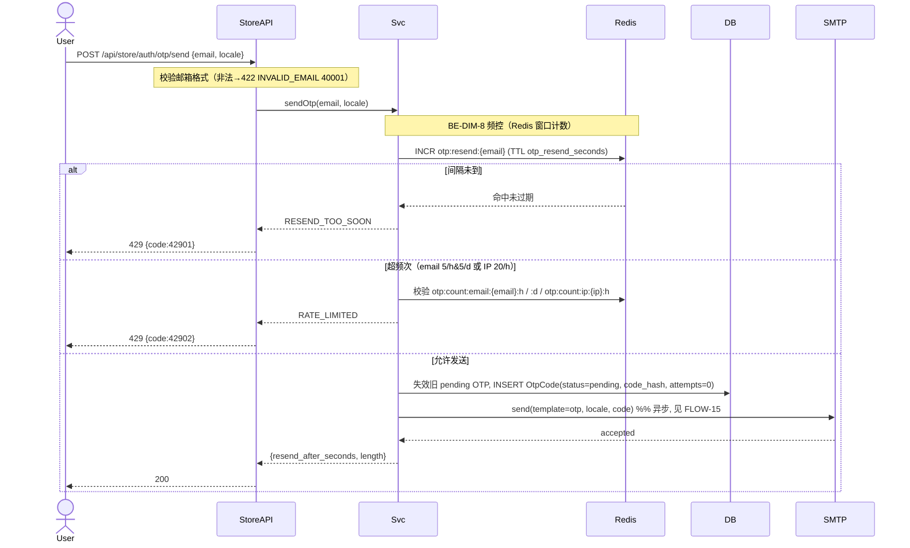

**异常路径**:
1. 邮箱格式非法 → 422 `40001 INVALID_EMAIL`（不生成 OtpCode）。
2. 重发间隔未到 → 429 `42901 RESEND_TOO_SOON`。
3. 发码超频 → 429 `42902 RATE_LIMITED`。
4. SMTP 发送失败 → 走 FLOW-15 重试；仍失败提示用户重试（不阻塞主流程，OtpCode 已落库）。

---

## FLOW-02: OTP 校验登录（关键事务，BE-DIM-4）

**触发条件**: 用户提交验证码。

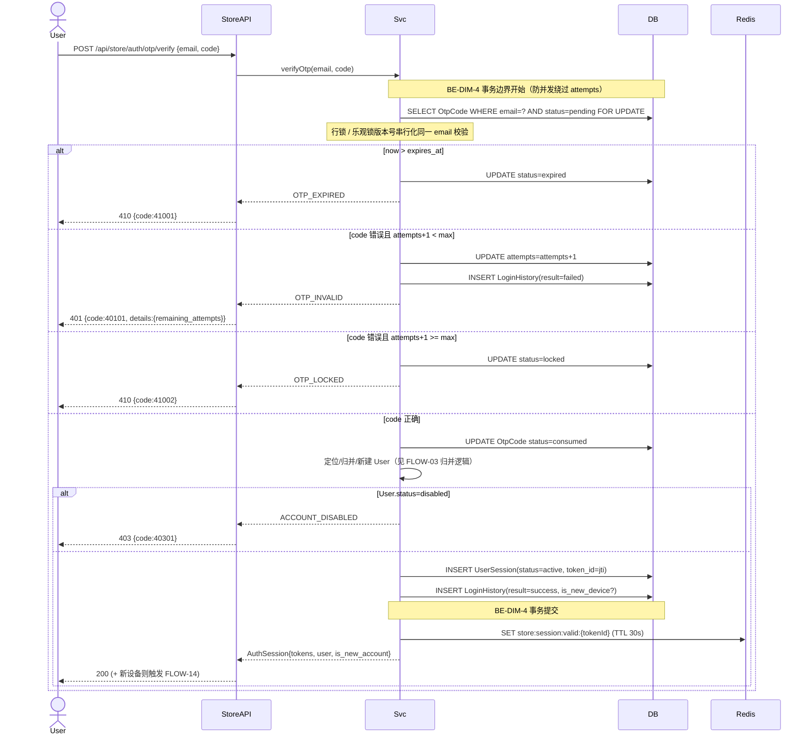

**异常路径**: 410 过期/锁定；401 验证码错误（attempts+1，写 failed LoginHistory）；403 账户禁用（不签发会话）。

---

## FLOW-03: OIDC 登录 + 自动归并（外部集成 BE-DIM-5 + 归并事务 BE-DIM-4）

**触发条件**: Google/Apple OIDC 回调。

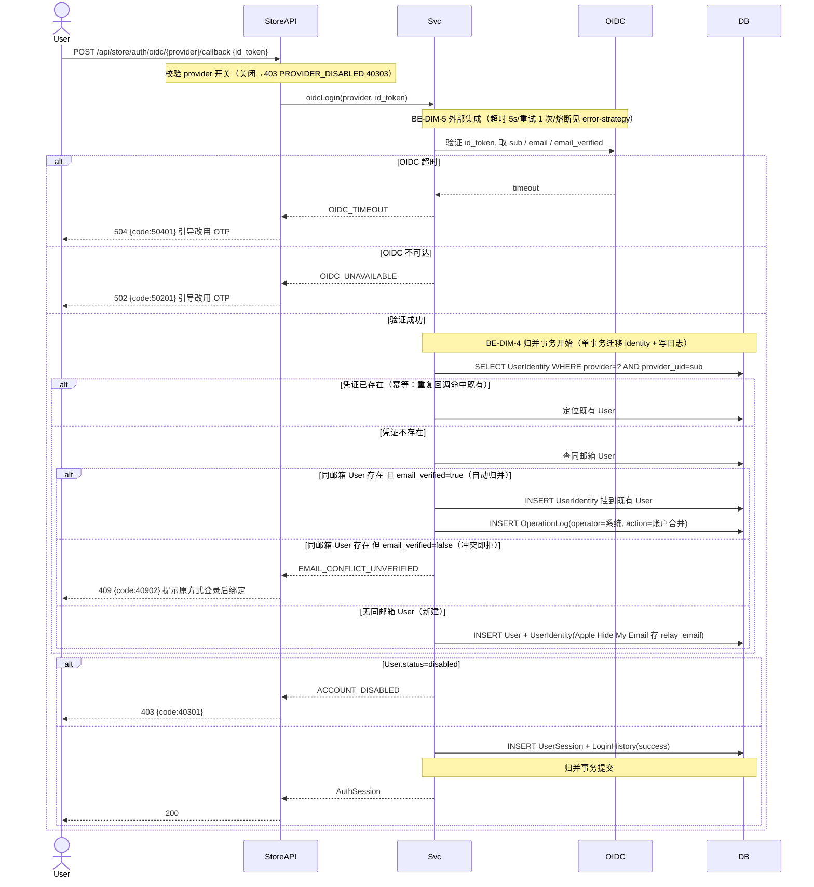

**异常路径**: 502/504 OIDC 不可用/超时（降级引导 OTP）；409 未验证邮箱冲突（不静默合并）；403 账户禁用/方式关闭。Apple relay 失效（FUNC-029）：标记 `relay_valid=false` 但 sub 仍可登录，不阻断。

---

## FLOW-04: refresh 续期

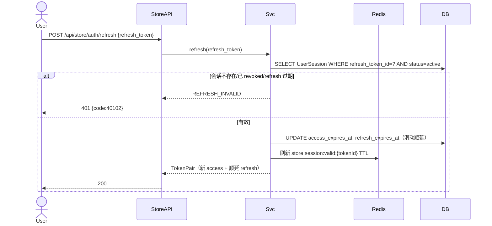

---

## FLOW-05: 绑定/解绑登录方式（BE-DIM-8 写失效）

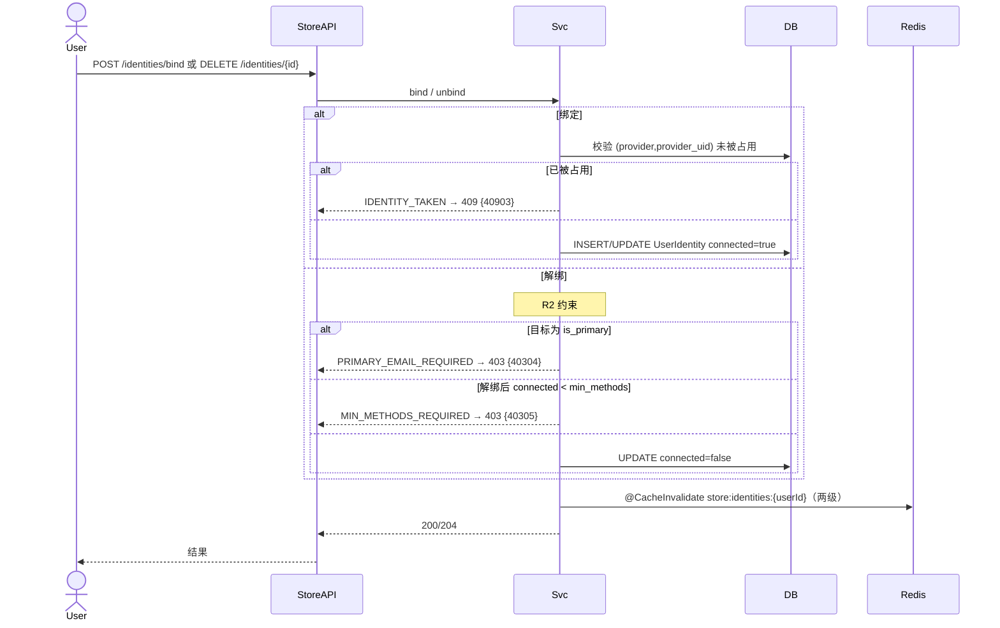

---

## FLOW-06: 换主邮箱

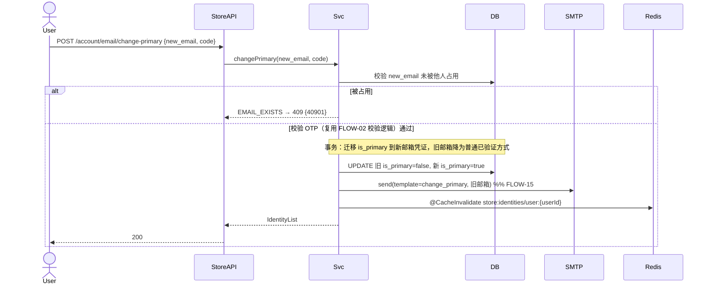

---

## FLOW-07: 会话撤销（登出他设备，BE-DIM-8 仅 Redis 单级强一致）

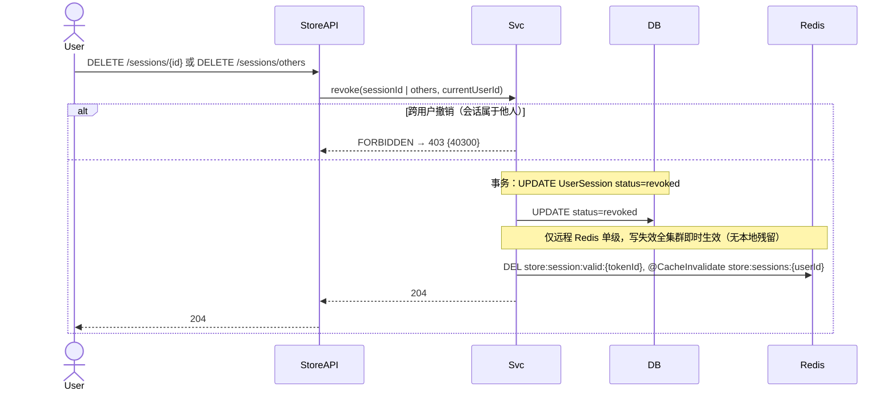

---

## FLOW-08: 账户注销 + 超宽限匿名化

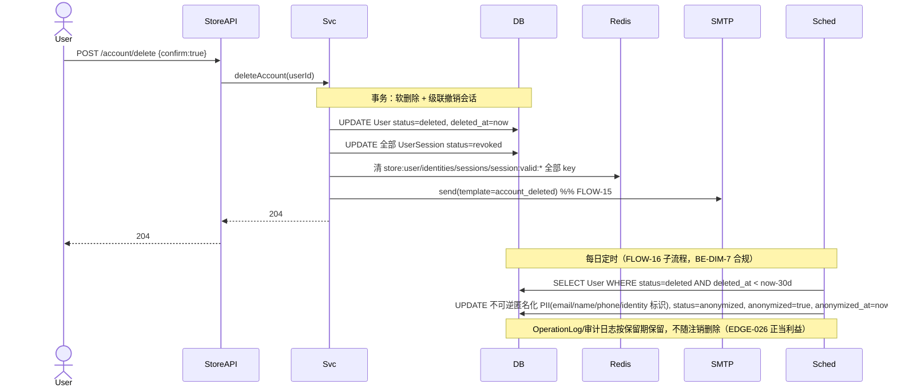

**异常路径**: EDGE-021 注销账户再次登录 → 不复活，按未验证冲突流（409 EMAIL_CONFLICT_UNVERIFIED）。

---

## FLOW-09: 管理员登录（BE-DIM-6 + BE-DIM-7）

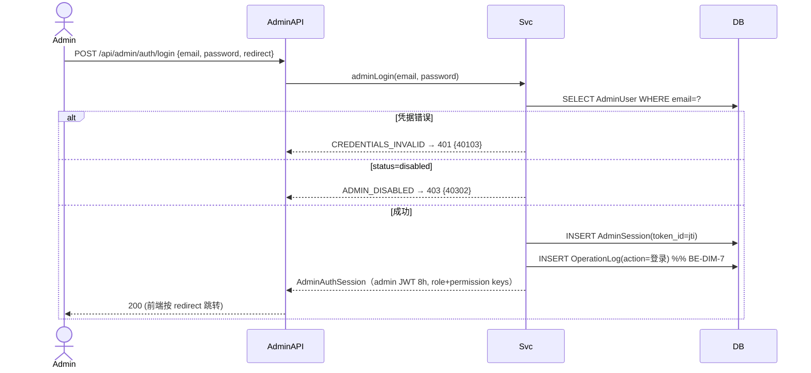

---

## FLOW-10: 管理员 CRUD（BE-DIM-6 RBAC + BE-DIM-7 审计）

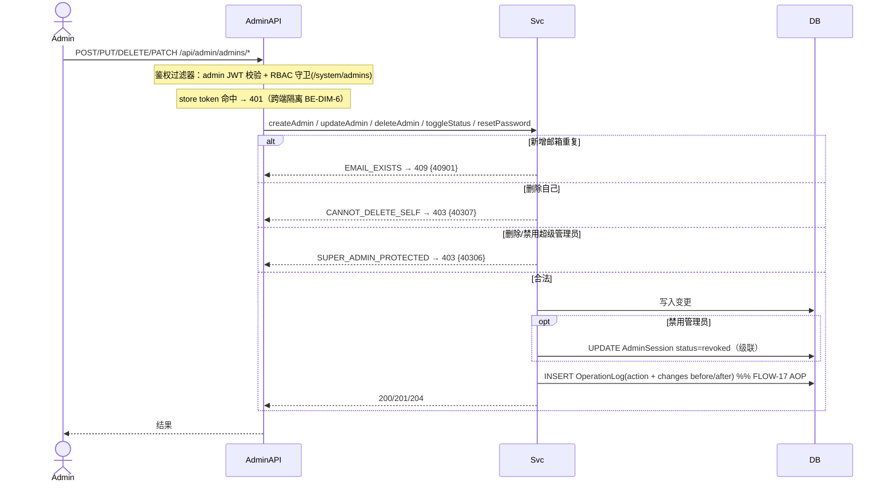

---

## FLOW-11: 角色权限保存

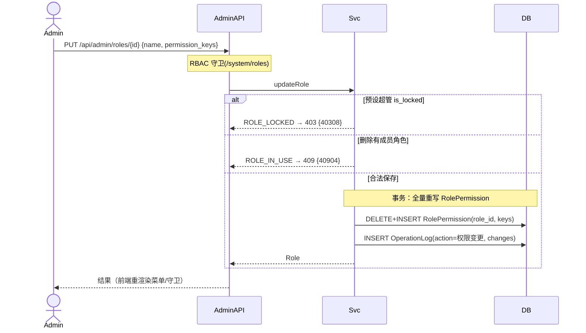

---

## FLOW-12: 用户身份运营（强制下线/禁用，BE-DIM-8 全集群即时生效）

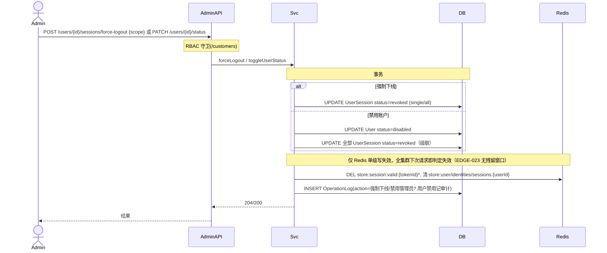

---

## FLOW-13: 认证配置保存（BE-DIM-8 写失效 store:authconfig）

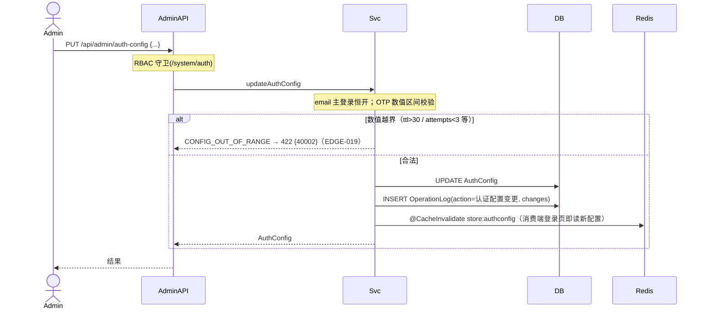

---

## FLOW-14: 新设备登录通知

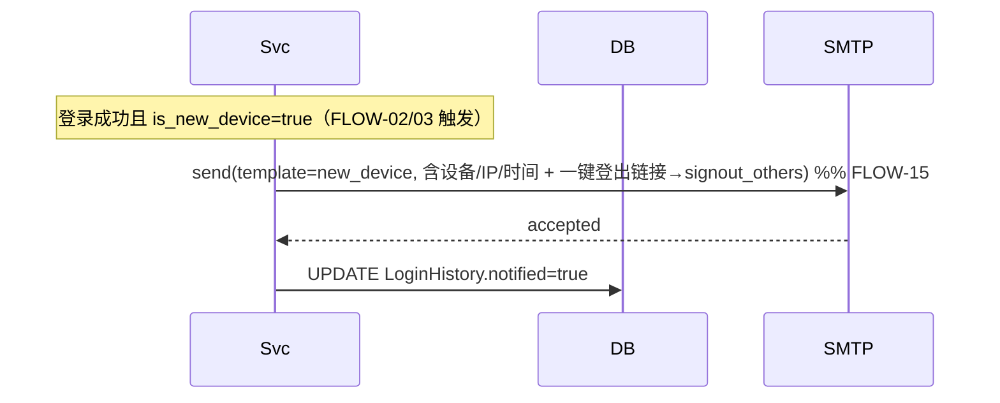

---

## FLOW-15: 邮件发送重试（BE-DIM-5 SMTP 降级）

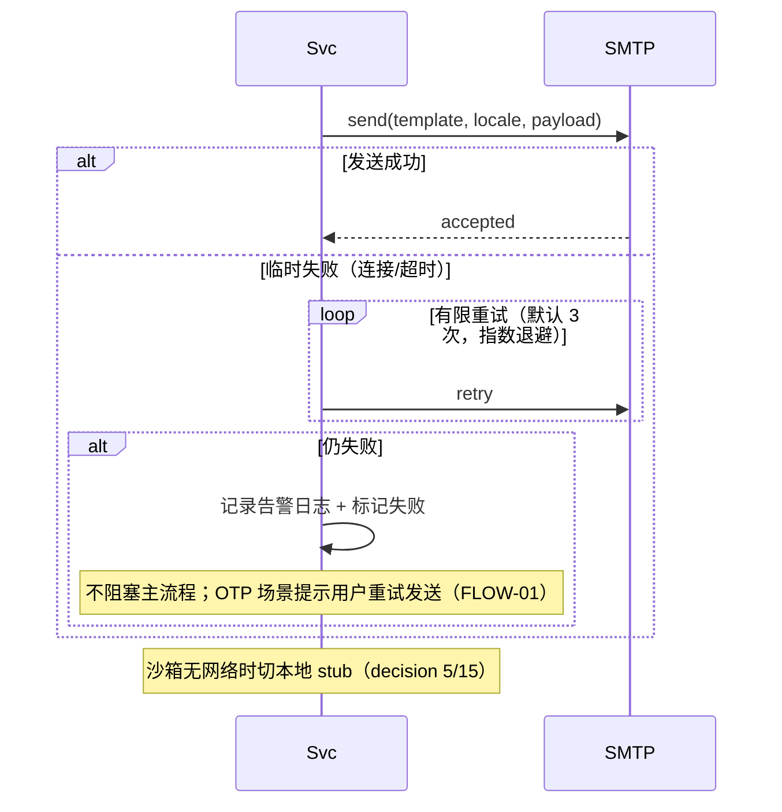

---

## FLOW-16: 数据保留清理（每日定时，BE-DIM-7 合规）

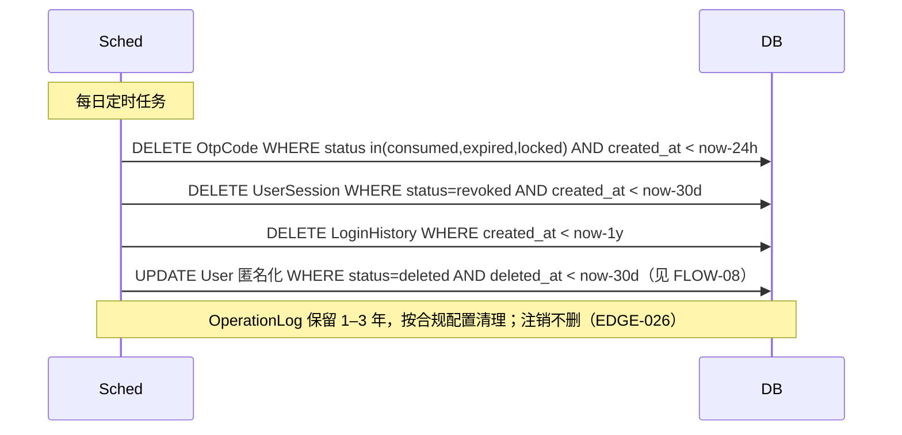

---

## FLOW-17: 操作审计写入（横切 AOP，BE-DIM-7）

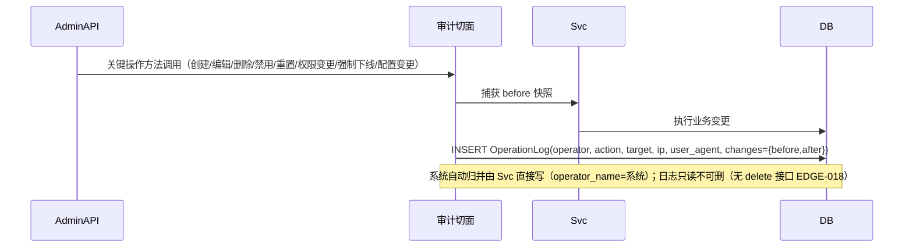

---

## 检查清单

- [x] 所有核心业务流程都有数据流图（17 个 FLOW 覆盖全部 34 FUNC 关键场景）
- [x] 数据流图包含正常路径和异常路径
- [x] 参与者命名清晰（User/Admin/StoreAPI/AdminAPI/Svc/Redis/DB/SMTP/OIDC/Sched/AOP）
- [x] 消息描述具体（含端点、错误码、事务边界）
- [x] 数据流与接口契约一致（端点与 openapi 一一对应）
- [x] 逐条响应 decision.md 后端关键决策（BE-DIM-4/5/6/7/8，见映射表）
