# 数据流 - portal-api-integration（七域前后端对接）

本文档定义 catalog / review / trading / shipping / marketing / showroom / analytics 七个限界上下文核心业务流程的数据流转，并逐条响应 `decision.md` 决策 3/4/6/7/8/9/10/13/14/16/17/19/20/22/24/25/28/29 与「后端关键决策」（BE-DIM-4 ~ BE-DIM-8）。与 baseline identity data-flow.md 同构（流程清单 + 决策映射 + 逐流程时序图）。

**参与者命名**：`User`（消费者，portal-store Next.js）、`Guest`（Showroom 免注册访客）、`Admin`（管理员，portal-admin Vue3）、`CDN`（Cloudflare 边缘缓存/WAF）、`Next`（portal-store Node standalone 运行时，决策 22）、`StoreAPI`/`AdminAPI`（Controller + StoreJwtFilter/AdminJwtFilter）、`Svc`（领域服务，各域 module）、`JC`（JetCache 两级 Caffeine+Redis）、`DB`（MySQL，MyBatis-Plus）、`MQ`（RabbitMQ）、`Stripe`、`GA4`（GA4 Data API）、`S3`（S3 兼容对象存储）、`SMTP`（邮件）、`Sched`（@Scheduled 定时任务）。

## 各层数据转换约定（横切）

| 边界 | 转换 | 说明 |
|------|------|------|
| portal-store ⇄ StoreAPI | camelCase（TS 对象）⇄ snake_case（线上 JSON），`lib/api/case.ts` deepSnakeize/deepCamelize | 契约字段一律 snake_case；locale 经 query 参数透传 |
| portal-admin ⇄ AdminAPI | 同上，`src/api/client.ts` axios 拦截器转换 | 分页消费 `PageResult`（total_elements 映射 totalElements） |
| Controller ⇄ Svc | Request DTO（@Valid 校验）⇄ 领域入参；响应 payload 装入 **R 包络** `{code,message,data}` | 分页统一 `huihao.page.Paginated`：data/total_elements/page_number/page_size/number_of_elements/total_pages（L1.2 契约 MUST_FIX-1） |
| Svc ⇄ DB | 实体（huihao-mysql 基类，Long 自增主键）⇄ 表行；translation 附表按 locale 合并：ES/FR 命中取附表字段，缺翻译回退 EN 主表（决策 13） | 消费端读 DTO 输出「已按 locale 解析」的扁平文案字段 |
| Svc ⇄ JC | @Cached key 统一含 locale 维度（消费端只读）；@CacheInvalidate 写失效 | 见「缓存矩阵」 |
| Svc ⇄ Stripe | 金额按订单币种最小货币单位换算（决策 14 锁汇后金额 × 100 取整）；webhook 负载只消费 id/type/data.object | BE-DIM-5 防腐层 |
| Svc ⇄ MQ | 领域事件 JSON（event_id + type + payload），消费侧按 event_id 幂等 | 见「MQ 事件拓扑」 |

## 核心业务流程清单

| 流程编号 | 流程名称 | 域 | 触发条件 | 参与模块 | 验收 |
|---------|---------|----|---------|---------|------|
| FLOW-P01 | 消费端只读数据流（三层缓存命中） | catalog/marketing/review | 用户浏览列表/详情/内容页 | CDN, Next, StoreAPI, Svc, JC, DB | ALIGN-002/016, FUNC-006 |
| FLOW-P02 | 商品全文搜索 | catalog | /search 提交关键词 | StoreAPI, Svc, JC, DB(FULLTEXT) | ALIGN-020, s-773/774 |
| FLOW-P03 | 内容发布秒级失效链（含 OP-011 静态页） | catalog/marketing | 后台保存/发布/上下架 | AdminAPI, Svc, JC, MQ, Next, CDN | s-758, FUNC-006 |
| FLOW-P04 | 购物车（加购/改量/匿名合并） | trading | 用户操作购物车/登录 | StoreAPI, Svc, DB | 决策 8 |
| FLOW-P05 | 结算报价（多承运商/券/锁汇试算） | trading+shipping+marketing | 进入结算/切换选项 | StoreAPI, Svc(trading→shipping/marketing 直调), JC, DB | F-036, 决策 14/15/28, 20.4/20.6 |
| FLOW-P06 | 下单原子事务 + PaymentIntent | trading | 提交订单 | StoreAPI, Svc, DB, Stripe | FUNC-001, BE-DIM-4 |
| FLOW-P07 | Stripe webhook 幂等消费 | trading | Stripe 异步回调 | Stripe, StoreAPI, Svc, DB, MQ | 决策 7/25 |
| FLOW-P08 | 待支付订单超时取消 | trading | 每分钟定时 | Sched, Svc, DB, Stripe | BE-DIM-4 |
| FLOW-P09 | 发货与订单状态流转 | trading | 后台标记发货/完成 | AdminAPI, Svc, DB, MQ | OP-009, s-752 |
| FLOW-P10 | 退款流（申请→审核→Stripe Refund） | trading | 消费端申请/后台审核 | StoreAPI/AdminAPI, Svc, DB, Stripe, MQ | ALIGN-007, s-755, 决策 24/31 |
| FLOW-P11 | 交易/Showroom 邮件消费者（MailRecord） | trading/showroom | MQ 邮件事件 | MQ, Svc, DB, SMTP | ALIGN-019, 决策 16/20.5 |
| FLOW-P12 | Showroom 协作（guest 会话/投票/指派/提醒） | showroom | 访客进入/互动，新娘管理 | User/Guest, StoreAPI, Svc, DB, MQ | ALIGN-023, s-1041 |
| FLOW-P13 | Wishlist / BrowseHistory 幂等写 | trading | 收藏/浏览 PDP | StoreAPI, Svc, DB | ALIGN-021/027 |
| FLOW-P14 | 评价提交与审核（rating 回写） | review | 用户提交/后台审核 | StoreAPI/AdminAPI, Svc, DB, MQ, JC | ALIGN-014, s-756/762 |
| FLOW-P15 | 营销定时投放/闪购到期下线 | marketing | @Scheduled 扫描 | Sched, Svc, DB, JC, MQ, Next, CDN | ALIGN-008/009, s-760/761 |
| FLOW-P16 | Dashboard/Analytics 聚合 + GA4 代理 | analytics | 后台打开看板 | AdminAPI, Svc, JC, DB, GA4 | ALIGN-001/013/022, s-759/s-1043 |
| FLOW-P17 | 预签名上传（S3 直传） | catalog（代管） | 后台/买家秀传图 | AdminAPI/StoreAPI, Svc, S3 | 决策 9 |
| FLOW-P18 | 汇率维护与展示换算 | trading | 后台改汇率/前端读取 | AdminAPI/StoreAPI, Svc, JC, DB, CDN | 决策 14 |
| FLOW-P19 | 公开落表/纯函数端点（尺码推荐/订阅/联系表单） | catalog/marketing | 用户提交 Find My Size 问卷 / Newsletter 订阅 / 联系表单 | CDN(WAF), StoreAPI, Svc, DB | size_recommendation（s-1042）、newsletter_subscribe、contact_submit；决策 20.3/26/30 |

横切流程沿用 identity 基建：**操作审计**（identity FLOW-17 AOP，七域后台写操作全部登记 action，BE-DIM-7）、**JWT 鉴权过滤**（StoreJwtFilter 配置化公开路径白名单 + showroom guest 旁路，L1.2 契约已标注、L2 定稿）。

## 决策响应映射

| 决策 | 本文档响应位置 |
|------|----------------|
| 决策 4/22 三层缓存 + 秒级失效链 | FLOW-P01 读命中、FLOW-P03 失效链、缓存矩阵 |
| 决策 6 双模式库存（乐观锁） | FLOW-P06 扣减、FLOW-P08/P10 回补 |
| 决策 7/25 Stripe 全家桶 | FLOW-P06/P07/P10 |
| 决策 8 购物车合并 | FLOW-P04 |
| 决策 9 预签名上传 | FLOW-P17 |
| 决策 10/19 聚合与 GA4 | FLOW-P16 |
| 决策 13 translation 回退 / 缓存 key 含 locale | 数据转换约定、缓存矩阵 |
| 决策 14/28 锁汇/礼品包装快照 | FLOW-P05/P06/P18 |
| 决策 16/20.5 MQ 邮件 + MailRecord | FLOW-P11 |
| 决策 17 FULLTEXT 搜索 | FLOW-P02 |
| 决策 20 Showroom（guest JWT/dye lot/ordered 推进） | FLOW-P12、FLOW-P07 扇出 |
| 决策 20.3 尺码推荐（区间匹配纯函数） | FLOW-P19（size_recommendation） |
| 决策 24/31 退款政策/审核制 | FLOW-P10 |
| 决策 26 Newsletter 仅落表（幂等 + WAF 限流） | FLOW-P19（newsletter_subscribe） |
| 决策 29 推荐位规则 + 销量回写 | FLOW-P01、MQ 拓扑（订单支付事件→回写） |
| 决策 30 联系表单落表 | FLOW-P19（contact_submit） |
| BE-DIM-4 事务/幂等/超时/MQ | FLOW-P06/P07/P08/P10、MQ 拓扑 |
| BE-DIM-5 外部集成降级 | FLOW-P07/P11/P16/P17 异常路径 |
| BE-DIM-6 user_id 隔离/RBAC | 各写流程鉴权注记；跨用户一律 404 防探测 |
| BE-DIM-7 审计 | 各后台写流程 OperationLog 注记 |
| BE-DIM-8 缓存分级/穿透保护 | 缓存矩阵（null 值短 TTL 缓存防穿透） |

---

## 缓存矩阵（BE-DIM-8：每条只读路径的缓存层级与失效触发者）

| 只读路径 | CDN | JetCache（key 维度） | 失效触发者 |
|----------|-----|---------------------|-----------|
| GET /api/store/products（列表/筛选） | s-maxage | 两级 `catalog:products:{filters}:{locale}` TTL 300s | 后台商品写/上下架/flags → FLOW-P03 |
| GET /api/store/products/{slug} | s-maxage（ISR 页同源） | 两级 `catalog:product:{slug}:{locale}` TTL 300s | 同上（含 SKU/尺码表/翻译变更） |
| GET /api/store/products/search | 不缓存 | 两级 `catalog:search:{q}:{locale}:{page}` TTL 60s | TTL 自然过期（决策 17 短 TTL 兜底） |
| GET /api/store/products/recommendations | s-maxage | 两级 `catalog:reco:{block}:{pid/tid}:{locale}` TTL 300s | 商品写 + 订单支付事件销量回写（FLOW-P07 扇出） |
| GET /api/store/categories | s-maxage | 两级 `catalog:categories:{locale}` TTL 600s | 后台分类写 |
| GET /api/store/tags | s-maxage | 两级 `catalog:tags:{dim}:{locale}` TTL 600s | 后台标签/维度写 |
| GET /api/store/content/banners·blogs·weddings·lookbooks·guides | s-maxage | 两级 `marketing:{res}:{params}:{locale}` TTL 300s | 后台内容写/发布 + 定时投放翻转（FLOW-P15） |
| GET /api/store/promotions/flash-sales | s-maxage（短） | 两级 `marketing:flash:{locale}` TTL 60s | 闪购写/到期下线（FLOW-P15） |
| GET /api/store/reviews、/api/store/questions | s-maxage 60s | 两级 `review:{res}:{product_id}:{page}` TTL 300s（评价不翻译，key 不含 locale） | 审核/回复/图片驳回/答复写（FLOW-P14） |
| GET /api/store/exchange-rates | s-maxage | 两级 `trading:exchange-rates` TTL 600s | 后台汇率维护（FLOW-P18） |
| 购物车/订单/地址/收藏/浏览历史/结算/支付/Showroom 全部 | 不缓存 | 不缓存（决策 4 第 3 层个人与交易数据） | — |
| GET /api/admin/dashboard、/api/admin/analytics/overview | 不经 CDN | 两级 `analytics:dashboard` / `analytics:overview:{range}` TTL 60s | TTL 自然过期（决策 10） |
| GET /api/admin/analytics/traffic | 不经 CDN | 两级 `analytics:traffic:{range}` TTL 300s | TTL 自然过期（决策 19） |
| shipping 规则（trading 进程内直调读） | — | 两级 `shipping:rates` / `shipping:carriers` TTL 600s | 本域写 @CacheInvalidate（进程内，无 MQ） |
| 后台全部列表/详情 | 不经 CDN | 不缓存（实时） | — |

**穿透保护（BE-DIM-8）**：JetCache 开启 `cacheNullValue`（null 短 TTL 60s），未命中且 DB 不存在的 slug/id 不反复打穿源库。

---

## FLOW-P01: 消费端只读数据流（三层缓存命中路径）

**触发条件**: 用户浏览商品列表/详情/内容页（任一 locale 路径 `/`、`/es`、`/fr`，决策 27）。

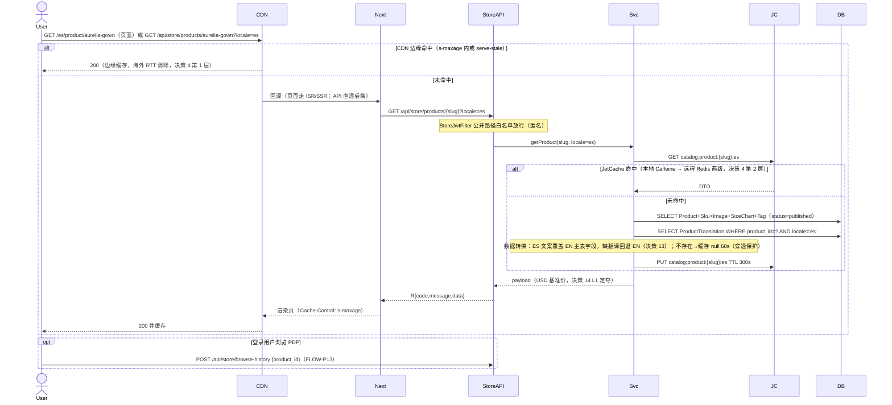

**异常路径**: 商品不存在/未发布 → 404 `404501`（null 缓存防穿透）；源站故障 → CDN serve-stale 吐旧缓存（决策 22，商城不白屏）。

---

## FLOW-P02: 商品全文搜索（决策 17）

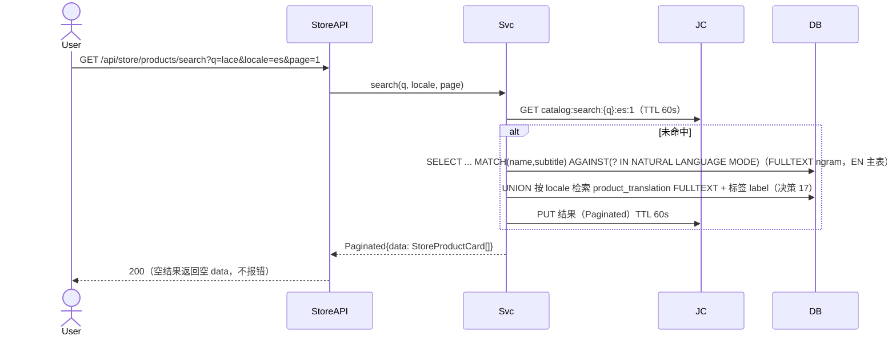

---

## FLOW-P03: 内容发布秒级失效链（OP-011 / s-758，决策 4/22 核心）

**触发条件**: 后台保存商品（「保存并生成静态页」）、上下架、内容发布、Banner/分类/标签写操作。

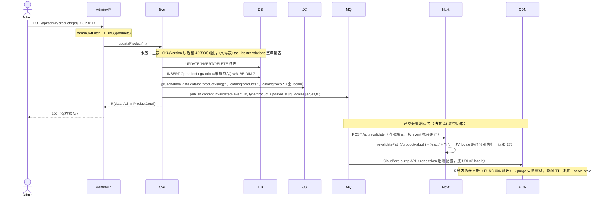

**异常路径**: MQ 投递失败 → 本地事务已提交，JetCache 已失效，CDN 靠 s-maxage TTL 兜底过期；消费者失败 → 重试 ×3 → 死信队列告警（见 MQ 拓扑）。

---

## FLOW-P04: 购物车（决策 8）

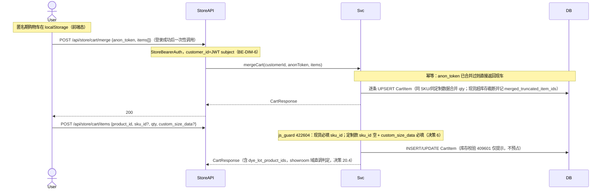

---

## FLOW-P05: 结算报价（跨域同步直调，决策 3）

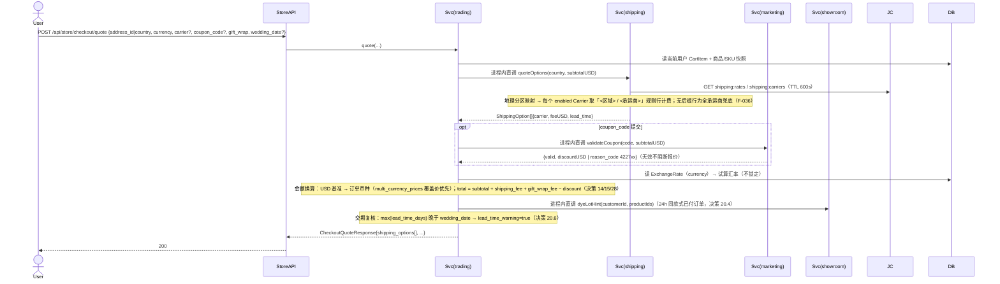

---

## FLOW-P06: 下单原子事务 + PaymentIntent（FUNC-001 核心，BE-DIM-4）

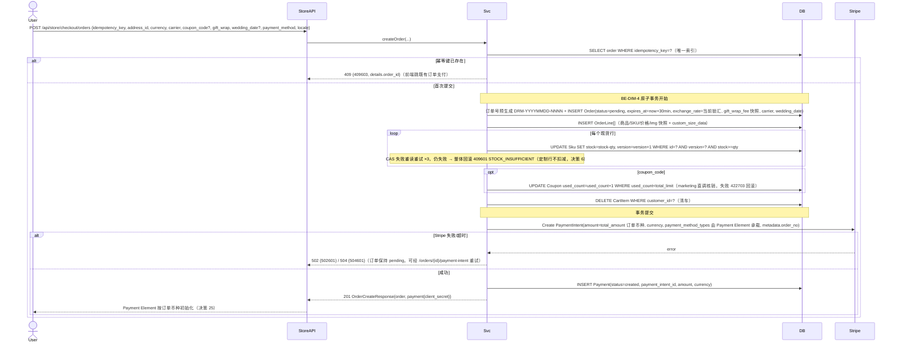

---

## FLOW-P07: Stripe webhook 幂等消费（决策 7/25）

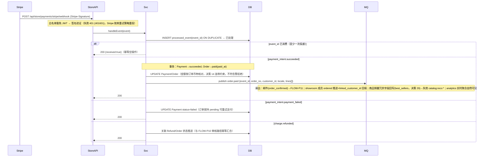

BNPL（Klarna/Afterpay）异步确认沿用同一链路（决策 25）：下单后 PaymentIntent 处于 processing，最终态由 webhook 驱动。

---

## FLOW-P08: 待支付订单超时取消（BE-DIM-4）

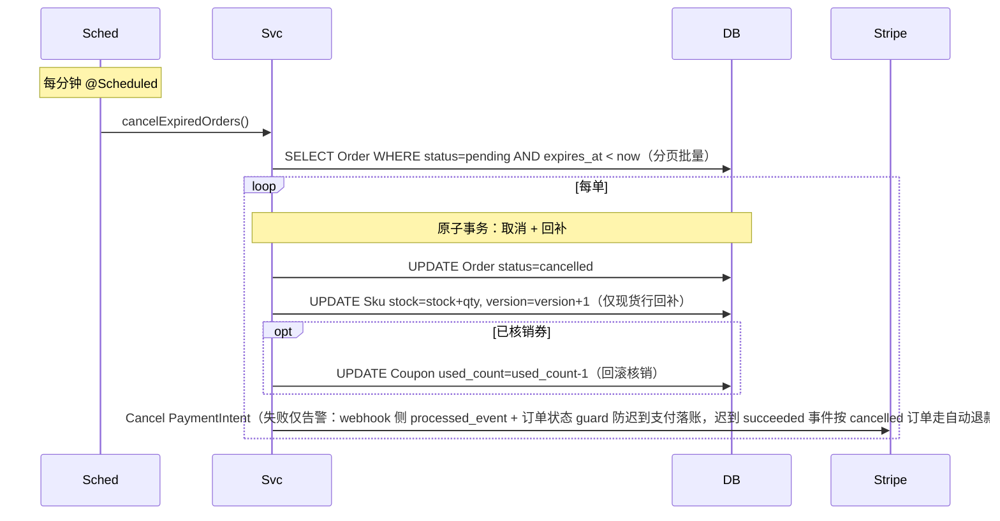

---

## FLOW-P09: 发货与订单状态流转（OP-009 / s-752）

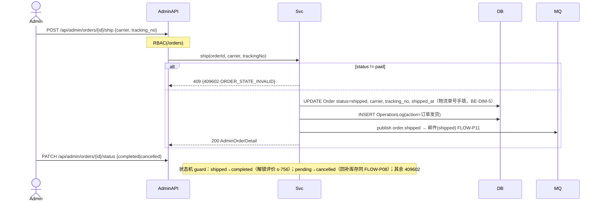

---

## FLOW-P10: 退款流（决策 24/31，s-755）

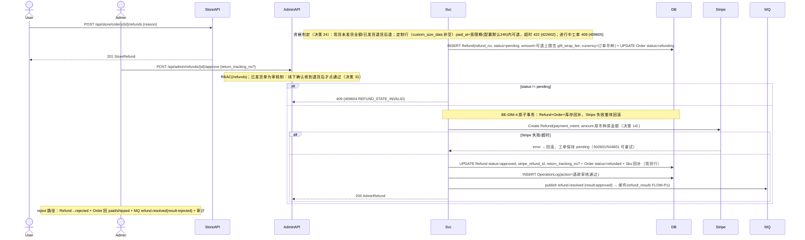

---

## FLOW-P11: 邮件消费者（MQ → MailRecord → SMTP，决策 16/20.5）

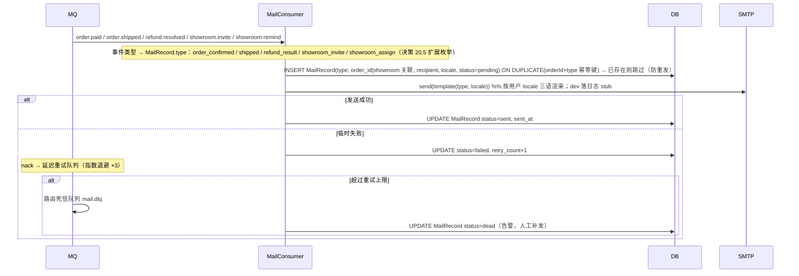

---

## FLOW-P12: Showroom 协作（决策 20，s-1041）

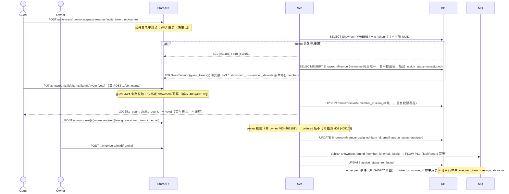

**邀请重置**: POST /showrooms/{id}/invite/reset → 新 UUID 落库 + invite 版本号自增 → 旧 guest JWT 即时失效（401101）。

---

## FLOW-P13: Wishlist / BrowseHistory（决策 18/23）

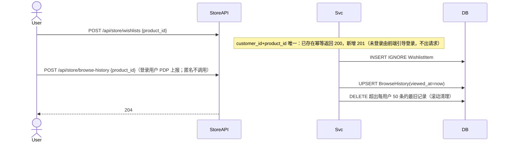

---

## FLOW-P14: 评价提交与审核（s-756/s-762 + rating 回写）

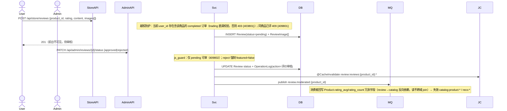

---

## FLOW-P15: 营销定时投放 / 闪购到期下线（ALIGN-008/009）

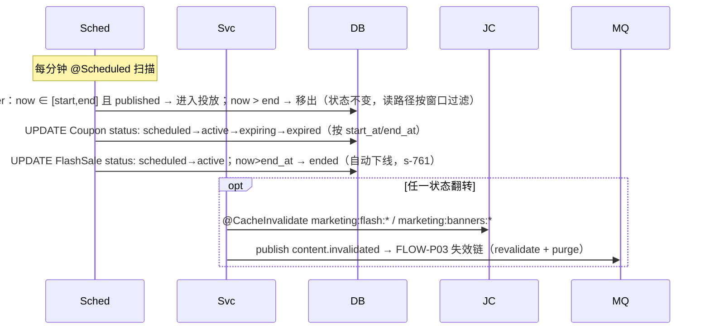

---

## FLOW-P16: Dashboard / Analytics 聚合 + GA4 代理（决策 10/19）

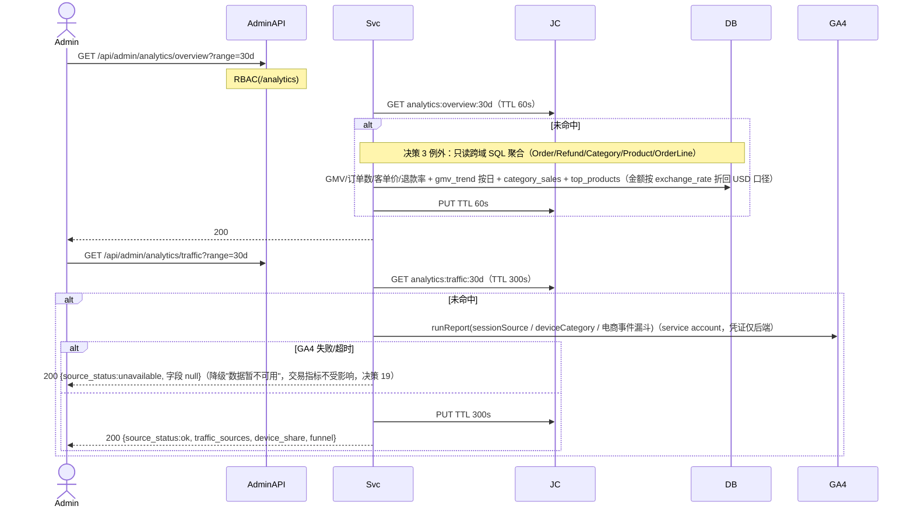

消费端埋点：gtag 标准电商事件 + Consent Mode v2 由 portal-store 直连 GA4，不经后端（决策 19 连带约束）。

---

## FLOW-P17: 预签名上传（决策 9）

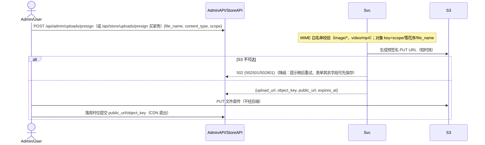

---

## FLOW-P18: 汇率维护与展示换算（决策 14）

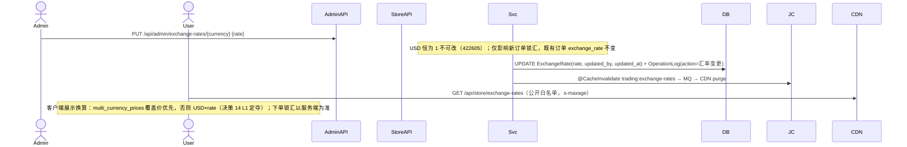

---

## FLOW-P19: 公开落表 / 纯函数端点（size_recommendation / newsletter_subscribe / contact_submit）

**触发条件**: 用户提交 Find My Size 问卷（PDP，决策 20.3，s-1042）、Newsletter 订阅（footer/弹窗/Exit Intent，决策 26）、联系表单（/contact，决策 30）。三条流程共性：匿名公开端点（StoreJwtFilter 白名单）、无跨域依赖、写限流全部在 Cloudflare WAF 层（决策 11），合并为一图。

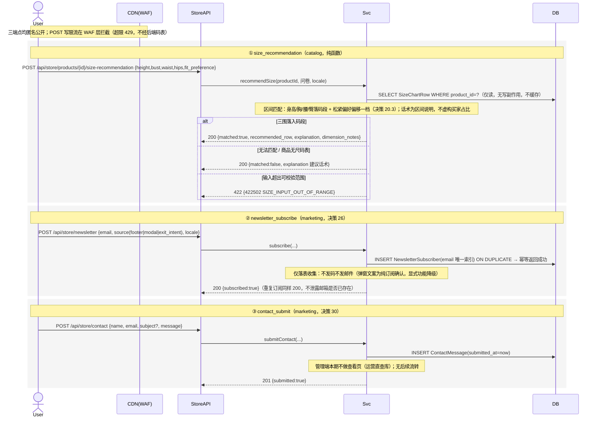

**异常路径**: 字段校验失败 → 422 `422502`（尺码输入越界）/ `422704`（邮箱格式/长度等 marketing 通用校验码）；WAF 超限 → 429（边缘拦截，决策 11）。三端点均不缓存、不发 MQ 事件、不写 OperationLog（非后台操作）。

---

## MQ 事件拓扑（RabbitMQ，BE-DIM-4）

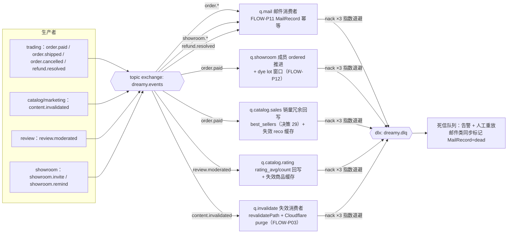

**消费幂等规范**：全部消费者按 `event_id` 去重（processed_event 表 / Redis SETNX）；回写类消费者操作天然可重入（UPSERT/覆盖写）。**顺序性**：同一 order_no 的事件按 routing key 单队列串行消费即可，不要求全局有序。

---

## 检查清单

- [x] 七域核心业务流程全部有数据流图（FLOW-P01~P19 + MQ 拓扑，覆盖 ALIGN-001~035 关键链路与 business-flow.yml 全部流程，含 size_recommendation / newsletter_subscribe / contact_submit）
- [x] 数据流图包含正常路径和异常路径（库存冲突/Stripe 失败/GA4 降级/token 失效/死信）
- [x] 参与者命名清晰（User/Guest/Admin/CDN/Next/StoreAPI/AdminAPI/Svc/JC/DB/MQ/Stripe/GA4/S3/SMTP/Sched）
- [x] 各层数据转换显式定义（snake_case ⇄ camelCase、R 包络/Paginated、translation 回退、锁汇换算、Stripe 金额单位）
- [x] 每条只读路径标注缓存层级与失效触发者（缓存矩阵，BE-DIM-8）
- [x] 三层缓存失效链与静态页 revalidate+purge 落图（FLOW-P03，决策 4/22，s-758/OP-011）
- [x] MQ 拓扑含死信重试与消费幂等（BE-DIM-4），邮件类型含 showroom_invite/showroom_assign（决策 20.5）
- [x] 外部集成数据流（Stripe/GA4/S3/SMTP）含超时与降级路径（BE-DIM-5）
- [x] 数据流与 L1.2 七份 OpenAPI 契约端点一一对应；逐条响应 decision.md 决策（见映射表）
