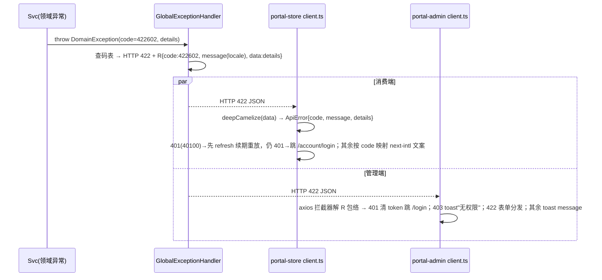

# 错误策略 - portal-api-integration（七域前后端对接）

本文档定义七个新限界上下文（catalog / trading / marketing / review / shipping / showroom / analytics）的分层错误处理、6 位错误码号段体系、R 包络错误传播、外部依赖降级与前端呈现约定。依据 decision.md 决策 11/12/19/24/26/30 与 BE-DIM-5/6/7/8，结构与 baseline identity error-strategy.md 对齐；identity 既有 5 位码体系不变。

## 错误响应格式（统一，与 R 包络的关系）

**契约层**（七份 openapi 的 ErrorResponse）：

```json
{ "code": 422602, "message": "Custom items already in production are not refundable", "details": { "grace_deadline": "2026-06-11T10:00:00Z" } }
```

**线上传输层**（huihao R 包络，L1.2 契约「R 包络映射」章节）：

```json
{ "code": 422602, "message": "...", "data": { "grace_deadline": "2026-06-11T10:00:00Z" } }
```

- 成功：`{ code: 0, message: "ok", data: <payload> }`；失败：`code` 为业务错误码，**details 内容装入 R 的 data 字段**。
- `message`：store 端按 locale 返回 EN/ES/FR 当前语言默认文案（前端仍按 code 映射 next-intl 字典做最终呈现，决策 27）；admin 端固定中文。
- 数字码为契约稳定锚点，文案变更不影响前端 code 映射。

## 错误码号段总表（决策 12 落地）

| 体系 | 格式 | 号段 | 归属 |
|------|------|------|------|
| identity 既有 | 5 位：HTTP(3)+序号(2) | 40000~50401（见 baseline error-strategy.md） | 不改动 |
| 新七域 | **6 位：HTTP(3)+域段(1)+序号(2)** | 域段：**catalog=5、trading=6、marketing=7、review=8、shipping=9、analytics=0、showroom=1**（决策 12 依次顺延、逢十回绕；showroom 为决策 20 新增域取 1） | 本 change |

高 3 位恒对应 HTTP 状态（与 identity 一致）；同域同 HTTP 状态下序号递增。集中码表按域维护在各 openapi info 码表，本表为权威汇总。

## 错误分类与七域码表汇总

> message_en 为 store 端默认文案基准；message_zh 为 admin 端文案与 store ES/FR 翻译源。ES/FR 文案与 EN 同步维护于前端 next-intl 字典（key=错误码）与后端 message bundle，机制与 identity 相同（决策 27）。仅后台触达的码（admin-only）不出三语。

### catalog（域段 5）

| code | 标识 | HTTP | message_zh | 触发 |
|------|------|------|-----------|------|
| 404501 | PRODUCT_NOT_FOUND | 404 | 商品不存在或未发布 | PDP/购物车引用失效（穿透保护 null 缓存） |
| 404502 | CATEGORY_NOT_FOUND | 404 | 分类不存在 | 分类引用失效 |
| 404503 | ATTRIBUTE_SET_NOT_FOUND | 404 | 属性集不存在 | admin-only |
| 404504 | ATTRIBUTE_DEF_NOT_FOUND | 404 | 属性定义不存在 | admin-only |
| 404505 | TAG_NOT_FOUND | 404 | 标签/维度不存在 | admin-only |
| 409501 | SLUG_EXISTS | 409 | 商品 slug 已存在 | admin-only |
| 409502 | CATEGORY_HAS_PRODUCTS | 409 | 分类下仍有商品，不可删除 | js_guard product_count===0 |
| 409503 | ATTRIBUTE_SET_IN_USE | 409 | 属性集被分类引用，不可删除 | admin-only |
| 409504 | SKU_CODE_EXISTS | 409 | SKU 码重复 | admin-only |
| 409505 | CATEGORY_LEVEL_EXCEEDED | 409 | 分类层级超过 3 层 | admin-only |
| 409506 | TAG_DIMENSION_IN_USE | 409 | 维度下仍有标签，不可删除 | admin-only |
| 409507 | ATTRIBUTE_DEF_IN_USE | 409 | 属性定义被属性集引用，不可删除 | admin-only |
| 409508 | PRODUCT_VERSION_CONFLICT | 409 | 商品已被他人修改，请刷新后重试 | SKU version 乐观锁 |
| 409509 | PRODUCT_NOT_DELETABLE | 409 | 已发布商品需先下架 | admin-only |
| 422501 | FIELD_VALIDATION_FAILED | 422 | 字段校验失败 | details 字段级（compare_at>=price 等） |
| 422502 | SIZE_INPUT_OUT_OF_RANGE | 422 | 尺码输入超出可匹配范围 | Find My Size（无法匹配场景走 200 matched=false，不报错） |
| 502501 | OBJECT_STORAGE_UNAVAILABLE | 502 | 对象存储暂不可用，请稍后重试 | 预签名失败（决策 9 降级） |

### trading（域段 6）

| code | 标识 | HTTP | message_zh | 触发 |
|------|------|------|-----------|------|
| 404601 | ORDER_NOT_FOUND | 404 | 订单不存在 | 含跨用户访问（BE-DIM-6 防探测） |
| 404602 | ADDRESS_NOT_FOUND | 404 | 地址不存在 | 同上 |
| 404603 | CART_ITEM_NOT_FOUND | 404 | 购物车条目不存在 | 同上 |
| 404604 | WISHLIST_ITEM_NOT_FOUND | 404 | 收藏不存在 | 同上 |
| 404605 | REFUND_NOT_FOUND | 404 | 退款工单不存在 | — |
| 409601 | STOCK_INSUFFICIENT | 409 | 库存不足 | 乐观锁 CAS 重试 ×3 仍失败（FLOW-P06） |
| 409602 | ORDER_STATE_INVALID | 409 | 当前订单状态不允许该操作 | 状态机 guard |
| 409603 | DUPLICATE_SUBMISSION | 409 | 请勿重复提交 | idempotency_key 命中，data.order_id 引导跳转 |
| 409604 | REFUND_STATE_INVALID | 409 | 工单已审核，不可重复操作 | js_guard pending |
| 409605 | REFUND_ALREADY_EXISTS | 409 | 该订单已有进行中的退款 | — |
| 410601 | ORDER_EXPIRED | 410 | 订单已超时取消 | 30min 超时（FLOW-P08） |
| 422601 | FIELD_VALIDATION_FAILED | 422 | 字段校验失败 | details 字段级 |
| 422602 | CUSTOM_ITEM_NOT_REFUNDABLE | 422 | 定制商品已投产，不可退款 | paid_at+宽限期（决策 24；前端入口置灰+三语说明） |
| 422603 | REFUND_AMOUNT_EXCEEDED | 422 | 退款金额超出可退上限 | amount<=total_amount 含礼品包装费（决策 28） |
| 422604 | SKU_REQUIRED | 422 | 请选择规格或填写定制尺寸 | js_guard 双模式（决策 6） |
| 422605 | CURRENCY_NOT_SUPPORTED | 422 | 币种不支持 | USD/EUR/CAD/AUD/GBP 之外；USD 汇率不可改 |
| 401601 | WEBHOOK_SIGNATURE_INVALID | 401 | webhook 签名校验失败 | Stripe-Signature 验签失败（不入业务） |
| 502601 | STRIPE_UNAVAILABLE | 502 | 支付服务暂不可用，请稍后重试 | 订单保持 pending 可重试 |
| 504601 | STRIPE_TIMEOUT | 504 | 支付服务超时，请稍后重试 | 同上 |

### marketing（域段 7）

| code | 标识 | HTTP | message_zh | 触发 |
|------|------|------|-----------|------|
| 404701 | CONTENT_NOT_FOUND | 404 | 内容不存在或未发布 | Banner/Blog/Lookbook/Guide/Wedding |
| 404702 | COUPON_NOT_FOUND | 404 | 优惠券不存在 | admin-only |
| 404703 | FLASH_SALE_NOT_FOUND | 404 | 闪购活动不存在 | admin-only |
| 409701 | COUPON_CODE_EXISTS | 409 | 券码已存在 | admin-only |
| 409702 | SLUG_EXISTS | 409 | 文章 slug 已存在 | admin-only |
| 409703 | CONTENT_STATE_INVALID | 409 | 当前发布状态不允许该操作 | 发布状态机 guard |
| 422701 | COUPON_INVALID | 422 | 优惠券不可用 | 校验端点走 200+valid=false+reason_code；仅下单事务内核销失败抛错 |
| 422702 | COUPON_MIN_AMOUNT_NOT_MET | 422 | 未达优惠券使用门槛 | 同上 |
| 422703 | COUPON_EXHAUSTED | 422 | 优惠券已被领完 | used_count>=total_limit |
| 422704 | FIELD_VALIDATION_FAILED | 422 | 字段校验失败 | end_at>start_at、email 格式等 |

### review（域段 8）

| code | 标识 | HTTP | message_zh | 触发 |
|------|------|------|-----------|------|
| 403801 | REVIEW_NOT_ALLOWED | 403 | 仅已完成订单的购买者可评价 | s-756/s-762 越权防护 |
| 404801 | REVIEW_NOT_FOUND | 404 | 评价不存在 | — |
| 404802 | QUESTION_NOT_FOUND | 404 | 提问不存在 | — |
| 404803 | REVIEW_IMAGE_NOT_FOUND | 404 | 评价图片不存在 | admin-only |
| 409801 | ALREADY_REVIEWED | 409 | 您已评价过该商品 | 同用户同商品唯一 |
| 409802 | REVIEW_STATE_INVALID | 409 | 仅待审核评价可审核 | js_guard pending |
| 409803 | FEATURED_REQUIRES_APPROVED | 409 | 仅已通过评价可精选 | js_guard |
| 409804 | REPLY_REQUIRES_APPROVED | 409 | 仅已通过评价可回复 | js_guard |
| 422801 | FIELD_VALIDATION_FAILED | 422 | 字段校验失败 | rating 1-5、trim 非空 |
| 502801 | OBJECT_STORAGE_UNAVAILABLE | 502 | 图片上传服务暂不可用 | 买家秀预签名失败 |

### shipping（域段 9，admin-only）

| code | 标识 | HTTP | message_zh | 触发 |
|------|------|------|-----------|------|
| 404901 | CARRIER_NOT_FOUND | 404 | 承运方不存在 | — |
| 404902 | SHIPPING_RATE_NOT_FOUND | 404 | 运费规则不存在 | — |
| 409901 | ZONE_EXISTS | 409 | 同名规则行已存在 | zone 文本唯一（含「区域 / 承运商」维度） |
| 409902 | LAST_ENABLED_CARRIER | 409 | 至少保留一个启用的承运方 | 全禁用则结算无选项、订单无法发货 |
| 422901 | FIELD_VALIDATION_FAILED | 422 | 字段校验失败 | 费用/门槛 >=0 |

### showroom（域段 1）

| code | 标识 | HTTP | message_zh | 触发 |
|------|------|------|-----------|------|
| 401101 | GUEST_TOKEN_INVALID | 401 | 访问凭证已失效，请重新打开邀请链接 | guest JWT 无效/过期/随邀请重置失效 |
| 403101 | NOT_SHOWROOM_OWNER | 403 | 仅创建者可执行该操作 | owner 校验 |
| 403102 | GUEST_SCOPE_EXCEEDED | 403 | 无权访问该协作空间 | guest 越权 |
| 404101 | SHOWROOM_NOT_FOUND | 404 | 协作空间不存在 | 含跨用户防探测 |
| 404102 | SHOWROOM_ITEM_NOT_FOUND | 404 | 款式不存在 | — |
| 404103 | SHOWROOM_MEMBER_NOT_FOUND | 404 | 成员不存在 | — |
| 409101 | NICKNAME_TAKEN | 409 | 该昵称已被使用，请换一个 | 同房昵称唯一（去重身份） |
| 409102 | ITEM_ALREADY_EXISTS | 409 | 该款式（颜色）已在协作空间中 | product_id+color 唯一 |
| 409103 | MEMBER_STATE_INVALID | 409 | 成员当前状态不允许该操作 | ordered 后不可再指派；未指派/无邮箱不可提醒 |
| 410101 | INVITE_TOKEN_REVOKED | 410 | 邀请链接已失效，请向新娘索取新链接 | 重置作废 |
| 422101 | FIELD_VALIDATION_FAILED | 422 | 字段校验失败 | 昵称/留言长度、email 格式 |

### analytics（域段 0，admin-only）

| code | 标识 | HTTP | message_zh | 触发 |
|------|------|------|-----------|------|
| 422001 | INVALID_RANGE | 422 | 时间范围参数非法 | range 枚举外 |
| 502001 | GA4_UNAVAILABLE | 502 | 流量数据服务不可用 | 仅缓存兜底亦失效时（常规降级 200+source_status=unavailable） |
| 504001 | GA4_TIMEOUT | 504 | 流量数据服务超时 | 同上 |

**复用 identity 既有码**：401 未认证/跨端 token 误用 → `40100`；RBAC 无权限 → `40300`；通用 404 → `40400`；500 内部错误 → `50000`；DB 异常 → `50001`；邮件发送失败 → `50002`。WAF 层限流（决策 11）由 Cloudflare 返回 429，不经后端码表。

**完整性核对**：七域共 75 个新码（catalog 17 / trading 19 / marketing 10 / review 10 / shipping 5 / showroom 11 / analytics 3），无重复；高 3 位与 HTTP 状态一致；号段无交叉；与 L1.2 七份 openapi info 码表逐一一致。

## 分层错误处理（GlobalExceptionHandler）

| 层级 | 职责 | 错误类型 | 处理方式 |
|------|------|----------|----------|
| **表示层（Controller + GlobalExceptionHandler + 两 JwtFilter）** | 捕获一切异常 → R.fail(code, message, data=details)；store 按 locale 选文案，admin 中文；公开路径白名单放行匿名；guest JWT 旁路注入受限主体；跨端 token 误用 401 `40100` | MethodArgumentNotValidException→422x01、DomainException、AccessDenied | 映射 HTTP + 6 位码；脱敏访问日志 |
| **应用层（各域 Svc）** | 业务规则与跨域直调校验（购买资格/退款资格/券核销/owner 校验） | OrderStateInvalid, CustomItemNotRefundable, ReviewNotAllowed, NotShowroomOwner, CouponExhausted | 抛领域异常，表示层映射 |
| **领域层（聚合根/状态机）** | 不变量与状态机 guard | StockInsufficient(乐观锁), RefundStateInvalid, MemberStateInvalid, ContentStateInvalid, VersionConflict | 抛领域异常向上传播 |
| **基础设施层（Repository / 集成端口 / MQ 消费者）** | DB/Stripe/GA4/S3/SMTP/MQ 错误 | DatabaseError→50001、StripeUnavailable/Timeout、Ga4Unavailable、StorageUnavailable、MailSendFailed | 转基础设施异常；按降级矩阵处理；MQ 消费异常 nack→重试→死信 |

**事务一致性约束**：凡「外部调用 + 本地写」的流（FLOW-P06/P10），Stripe 调用置于本地事务边界外（下单）或失败整体回滚（退款审核），保证不出现「钱动账不动」；webhook 为最终一致补偿通道。

## R 包络错误传播路径（后端 → 两端前端）



前端不解析 message 文案做逻辑分支，**一律按 code 分支**；未知 code 兜底 `50000` 通用提示。

## 外部依赖失败降级矩阵（BE-DIM-5）

| 依赖 | 失败形态 | 降级行为 | 对用户影响 |
|------|---------|---------|-----------|
| **Stripe** | 创建 PaymentIntent/Refund 失败、超时 | 下单：订单保持 pending，返回 502601/504601，可经 `/orders/{id}/payment-intent` 重试；退款审核：事务整体回滚，工单保持 pending 可重审 | 提示稍后重试；30min 未支付走超时取消回补（FLOW-P08） |
| **Stripe webhook** | 签名失败 / 重复投递 | 401 `401601`（Stripe 自动重投）；event_id 幂等空操作 200 | 无感知 |
| **GA4 Data API** | 拉取失败/超时 | 200 + `source_status=unavailable` + 字段 null（决策 19）；缓存兜底亦失效才 502001/504001 | 流量图表显示"数据暂不可用"，交易指标不受影响 |
| **RabbitMQ 投递** | publish 失败 | 本地事务不回滚；失效链靠 JetCache 已失效 + CDN TTL 兜底；邮件/回写类记录告警日志补偿 | 缓存新鲜度退化为 TTL 级，功能不损 |
| **RabbitMQ 消费** | 消费异常 | nack → 指数退避重试 ×3 → 死信队列告警 + 人工重放；邮件类同步置 MailRecord=dead | 邮件延迟/人工补发 |
| **SMTP** | 发送失败 | MailRecord failed + retry_count，延迟重试 ×3 → dead（FLOW-P11）；dev 环境 stub 落日志 | 交易主流程不阻塞 |
| **Cloudflare purge** | purge API 失败 | 重试；期间 CDN 按 s-maxage TTL 自然过期 + serve-stale 兜底（决策 22），revalidatePath 已先行 | 边缘新鲜度短暂退化 |
| **S3 预签名** | 不可达 | 502501/502801，表单其余字段可先保存 | 图片稍后补传 |
| **MySQL** | 访问失败 | 50001 DATABASE_ERROR（不暴露 SQL）；消费端读路径 CDN serve-stale 吐旧值 | 写失败明确报错；读尽量不白屏 |

## 前端错误呈现约定

### portal-store（消费端，三语）

| 状态/码 | 呈现 |
|---------|------|
| 422（x01 字段级） | details（R.data）按 field→message 渲染表单 inline 错误；非表单场景 toast |
| 422602 定制不可退 | 订单详情退款入口置灰 + 三语政策说明（决策 24，read 时已由 refund_eligible/refund_block_reason_code 预判，错误码为双重防线） |
| 409601 库存不足 | 购物车/结算行内提示并引导调整数量 |
| 409603 重复提交 | 静默跳转 data.order_id 既有订单支付页 |
| 409（其余业务冲突） | toast（按 code 映射 next-intl 文案） |
| 401 `40100` | 先 refresh 续期重放一次；仍失败清 token → 跳 `/account/login`（带 returnTo）；`401101` guest 凭证失效 → 提示重新打开邀请链接 |
| 403 | `403801` 评价入口隐藏+提示；`403101/403102` Showroom 权限提示页 |
| 404 个人资源 | 通用"不存在或无权访问"页（防探测语义，不区分） |
| 410601 / 410101 | 订单超时/邀请失效专属提示 + 引导动作 |
| 429（WAF） | 通用"请求过于频繁"提示 |
| 5xx / 502601 / 504601 | 通用错误态组件（复用既有 token 风格）+ 重试按钮 |

### portal-admin（管理端，中文）

| 状态/码 | 呈现 |
|---------|------|
| 422 字段级 | 表单字段 inline（el 风格沿用现有组件）；其余 toast |
| 409 业务冲突 | toast（如 409502"分类下仍有商品"、409604"工单已审核"）；409508 乐观锁提示刷新重载表单 |
| 401 | 清 token → 跳 `/login`（admin JWT 8h 无 refresh，沿用 identity 约定） |
| 403 `40300` | toast"无权限"；菜单/路由由 permissions 预隐藏（RBAC 守卫），错误码为兜底 |
| 502601/504601 退款 Stripe 失败 | 工单保持 pending，弹窗提示可重试 |
| 502001 GA4 | 流量卡片"数据暂不可用"占位态（交易卡片正常） |
| 5xx | toast"操作失败" + 保留表单现场 |

## webhook 安全（决策 7，BE-DIM-4）

1. **签名验证**：`Stripe-Signature` 头 HMAC 校验（webhook secret 仅后端配置）；失败 → 401 `401601`，**不读取负载、不写任何业务数据、不落 processed_event**；记录脱敏告警日志（Stripe 将按其退避策略重投）。
2. **event_id 幂等**：验签通过先 `INSERT processed_event(event_id)`（唯一索引）；冲突即已消费 → 200 空操作。processed_event 保留 90 天后清理（迟到重投窗口远小于此）。
3. **金额/币种核对**：succeeded 事件按订单币种与 total_amount 核对（决策 14 连带约束），不符 → 不变更订单、告警人工介入。
4. **状态 guard**：cancelled 订单收到迟到 succeeded → 不复活订单，自动发起 Stripe 退款补偿并告警（FLOW-P08 注记）。
5. **传输**：端点仅接受 POST + JSON；在 WAF 层放行 Stripe 源（决策 11），不做 JWT 鉴权（白名单豁免）。

## 审计与脱敏（BE-DIM-7，沿用 identity 机制扩展）

- **OperationLog 新增 action 枚举**（七域后台写操作）：创建/编辑/删除商品、商品上下架、创建/编辑/删除分类、编辑属性集、创建/编辑/删除标签（维度）、订单发货、订单状态变更、发起退款、退款审核通过、退款审核拒绝、创建/编辑/删除优惠券、创建/编辑/删除闪购、创建/编辑/删除 Banner、文章/案例/Lookbook/指南 创建/编辑/删除/发布状态变更、评价审核、评价批量操作、回答提问、创建/编辑/删除承运方、承运方状态变更、创建/编辑/删除运费规则、汇率变更、结算配置变更。日志只读不可删（EDGE-018 同约束）。
- **脱敏规则**（在 identity 基础上扩展）：

| 类别 | 规则 |
|------|------|
| Stripe secret / webhook secret / client_secret | 完全不落日志；client_secret 不落库（即取即用） |
| payment_intent_id / stripe_refund_id | 可落库可入日志（非敏感引用） |
| 收货地址/电话（PII） | 日志仅记 order_no，不记 address_snapshot 内容 |
| invite_token / guest JWT | 日志仅记 showroom_id + member_id，token 原文 `[REDACTED]` |
| 定制尺寸 custom_size_data | 业务必要落库；日志不记明细 |
| GA4 service account 凭证 / Cloudflare zone token / S3 密钥 | 仅后端配置，任何响应与日志不出现 |
| 错误 message | 不回显用户输入原文与他人资源存在性（404 防探测口径） |

## L2 设计要求

L2 Error Designer / Detail Designer 须在详设中：
1. 定义 GlobalExceptionHandler 异常类型→码表的完整映射表（含 MethodArgumentNotValidException → 各域 422x01 的 details 字段级结构）。
2. 落地 StoreJwtFilter 配置化公开路径白名单 + showroom guest JWT 旁路（claims：showroom_id/member_id/invite 版本号）的过滤器链设计。
3. 给出 processed_event 表结构与清理任务、MailRecord 重试/死信的 MQ 队列参数（TTL、retry 次数、DLX 命名）。
4. 给出 next-intl 错误码字典三语文案清单（以本表 message_zh/message_en 为源）与后端 message bundle 结构。
5. 明确 Paginated 扩展包装 DTO（评价聚合字段）与 huihao.page.Paginated 的继承/组合方式。

## 检查清单

- [x] 错误码体系完整（覆盖 401/403/404/409/410/422/429/500/502/504 全部场景，七域 75 码 + identity 复用码）
- [x] 错误码无重复、号段无交叉（6 位 HTTP+域段+序号，与决策 12 一致）
- [x] 每个错误码有 message_zh 与触发说明；store 触达码三语机制明确（next-intl 按 code 映射）
- [x] R 包络错误传播路径明确（GlobalExceptionHandler → 两端 client.ts 处理约定）
- [x] 外部依赖降级矩阵完整（Stripe/GA4/MQ 死信/SMTP 重试/CDN purge+serve-stale/S3）
- [x] 前端错误呈现约定两端分列（422 字段级 / 409 toast / 401/403 跳转）
- [x] webhook 安全完整（签名失败处理 + event_id 幂等 + 金额核对 + 迟到事件补偿）
- [x] 审计 action 枚举与脱敏规则覆盖七域（BE-DIM-7）
- [x] 与 L1.2 七份 openapi 码表、data-flow.md 流程编号交叉引用一致
