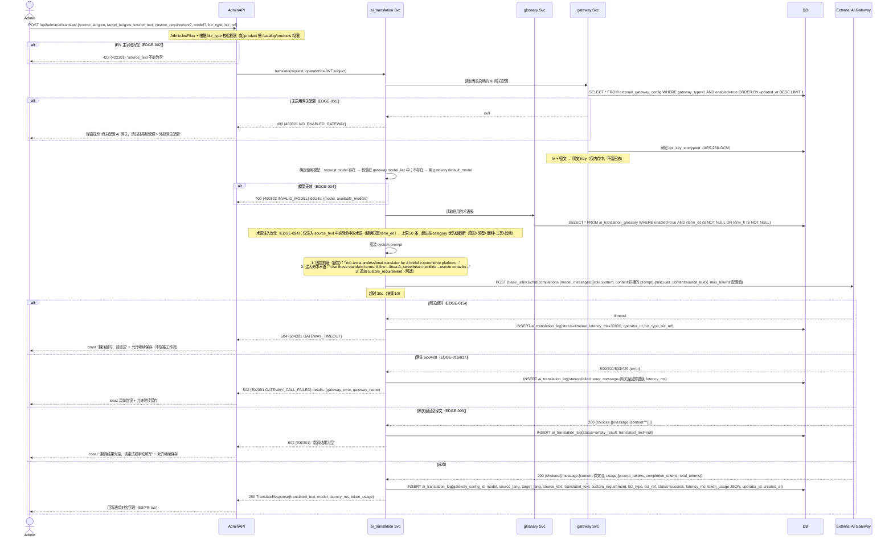
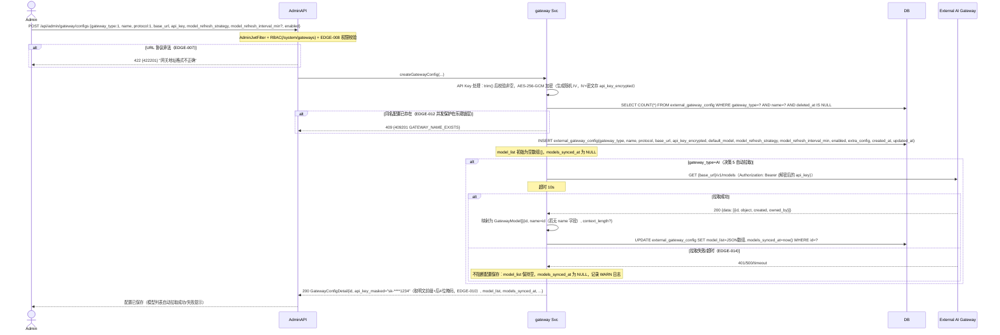
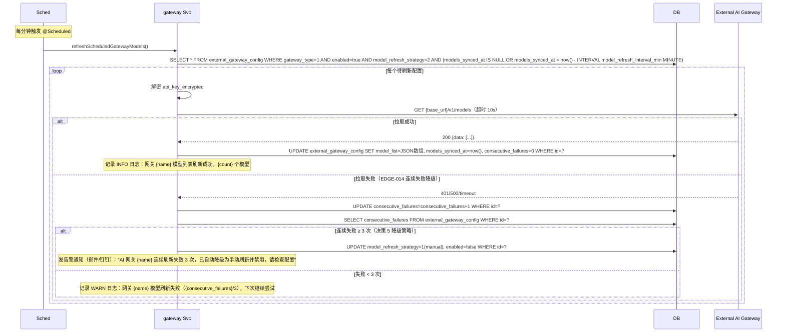
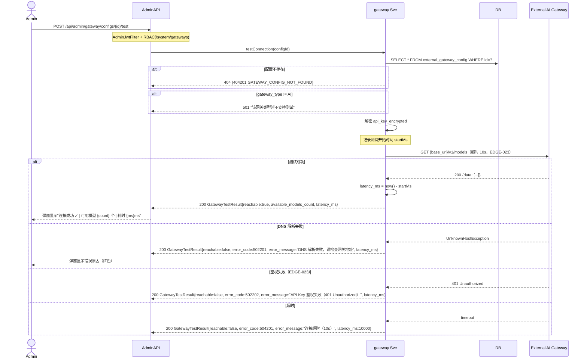
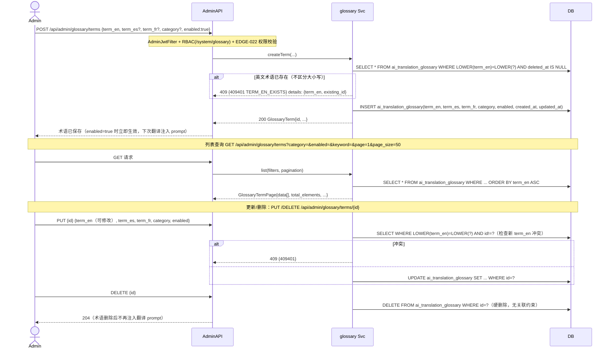
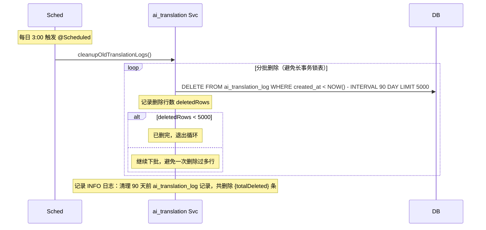
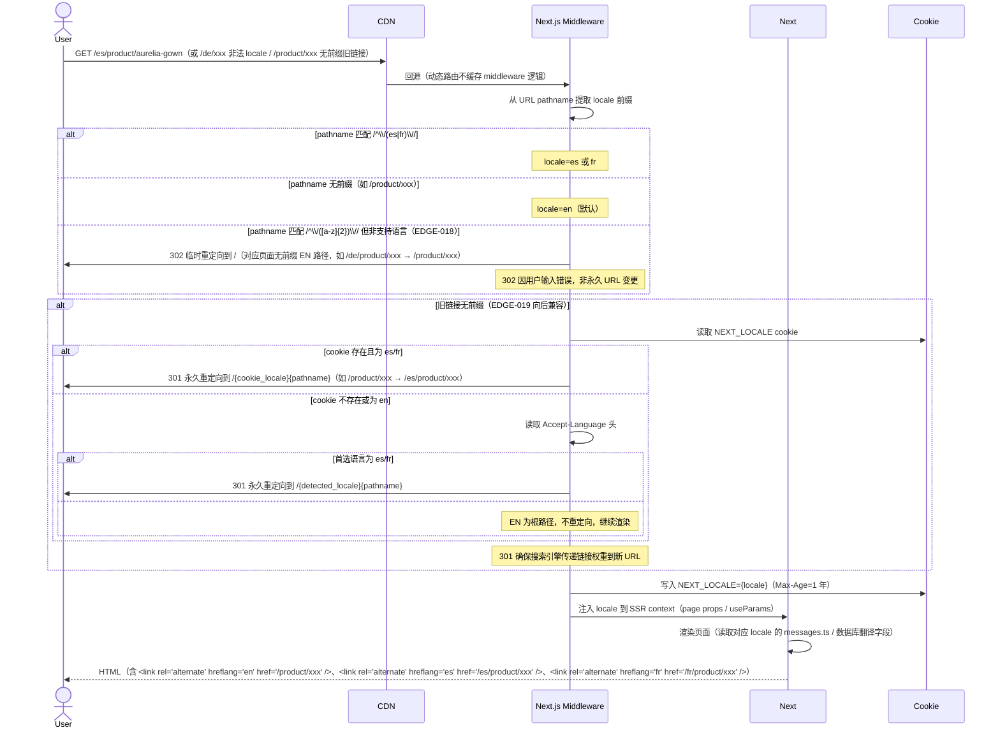
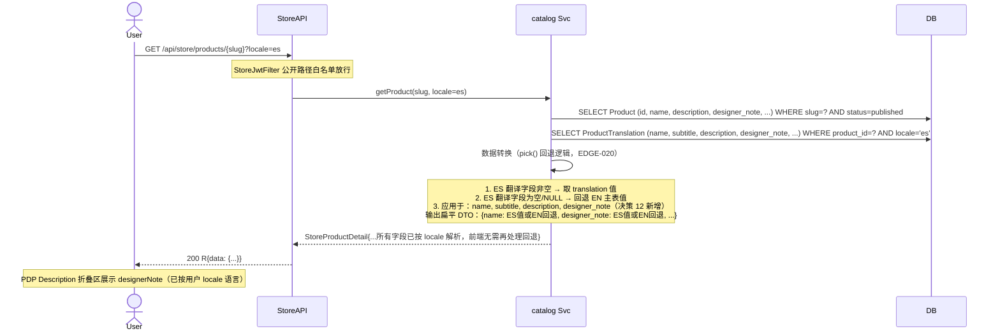
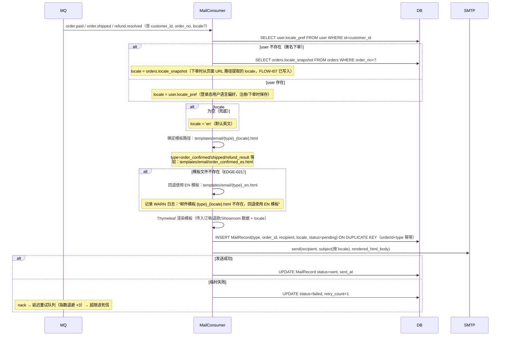

# 数据流 - i18n-complete-with-ai-assist（增量）

本文档定义 i18n 变更新增的 AI 翻译、网关配置、术语表管理、locale 路由、数据级翻译回退等数据流转，逐条响应 `decision.md` 决策 1~14 与 `boundary-scenarios.yml` 24 个 EDGE 场景。与 baseline 七域 data-flow.md 并列（baseline 无 gateway/glossary/ai_translation 域，本变更新增）。

**参与者命名**：`Admin`（portal-admin Vue3 运营）、`User`（portal-store Next.js 消费端登录用户）、`Guest`（匿名访客）、`AdminAPI`（AdminGatewayController/AdminAiController/AdminGlossaryController）、`Svc`（gateway/ai_translation/glossary 三域服务）、`DB`（MySQL）、`Gateway`（外部 AI 网关，OpenAI-compatible /v1/chat/completions + /v1/models）、`Sched`（@Scheduled 定时任务）、`Middleware`（Next.js middleware locale 检测）、`CDN`（Cloudflare 边缘）。

## 各层数据转换约定（增量）

| 边界 | 转换 | 说明 |
|------|------|------|
| AdminAPI ⇄ Svc | Request DTO（@Valid 校验）⇄ 领域入参；响应装入 R 包络 `{code,message,data}` | API Key 字段：前端提交明文或掩码（sk-****xxxx），后端判定：明文→AES 加密存储；掩码→保持原密文不变 |
| Svc ⇄ Gateway | OpenAI-compatible JSON | /v1/chat/completions POST {model, messages[{role,content}], max_tokens?}；/v1/models GET 返回 [{id, name, context_length}] |
| Svc ⇄ DB | ExternalGatewayConfig.api_key_encrypted（AES-256-GCM IV+密文）⇄ 明文 Key；model_list/extra_config JSON 列 | 解密仅在调用时内存中进行，任何响应/日志均掩码（sk-****1234） |
| portal-store locale 路由 | URL 路径 `/es/product/xxx` → middleware 提取 locale=es → cookie `NEXT_LOCALE` → SSR context | EN 为根路径（无前缀），ES/FR 为 `/es/`、`/fr/` 前缀（决策 11） |
| 数据级翻译回退 | product_translation.designer_note(ES) 为空 → pick() 回退读 product.designer_note(EN 主表) | 消费端 assembleDetail 输出扁平字段，已按 locale 解析（决策 12） |
| 邮件 locale 选择 | user.locale_pref → orders.locale_snapshot → 默认 EN | 模板路径 `templates/email/{name}_{locale}.html`（决策 13） |

## 核心业务流程清单

| 流程编号 | 流程名称 | 域 | 触发条件 | 参与模块 | 验收 |
|---------|---------|----|---------|---------|----- |
| FLOW-I01 | AI 翻译请求流（后端代理 + 术语表注入） | ai_translation/glossary | 后台点击「AI 翻译」按钮 | Admin, AdminAPI, Svc, Gateway, DB | FUNC-008~010, 决策 2/6/14, EDGE-001~003/015~017 |
| FLOW-I02 | 网关配置保存 + 自动模型发现 | gateway | 后台创建/更新 AI 网关配置 | Admin, AdminAPI, Svc, Gateway, DB | FUNC-004~007, 决策 1/3/5, EDGE-006/007/014 |
| FLOW-I03 | 模型列表定时刷新 | gateway | @Scheduled 扫描 model_refresh_strategy=scheduled 配置 | Sched, Svc, Gateway, DB | 决策 5, EDGE-014 |
| FLOW-I04 | 测试网关连接 | gateway | 后台点击「测试连接」按钮 | Admin, AdminAPI, Svc, Gateway | 决策 14, EDGE-023 |
| FLOW-I05 | 术语表 CRUD | glossary | 后台术语表管理页 | Admin, AdminAPI, Svc, DB | FUNC-022, 决策 14, EDGE-022/024 |
| FLOW-I06 | 调用日志清理 | ai_translation | @Scheduled 每日 3:00 | Sched, Svc, DB | 决策 7 |
| FLOW-I07 | 消费端 locale 路由检测 | identity（复用现有） | 用户访问任意 URL | User/Guest, CDN, Middleware, Next | 决策 11, EDGE-018/019 |
| FLOW-I08 | designerNote 数据级翻译回退 | catalog（增强现有 FLOW-P01） | 消费端 PDP 请求 | User, StoreAPI, Svc, DB | 决策 12, EDGE-020 |
| FLOW-I09 | 邮件三语发送 | identity/trading/showroom（增强现有 FLOW-P11） | MQ 邮件事件触发 | MQ, Svc, DB, SMTP | 决策 13, EDGE-021 |

## 决策响应映射

| 决策 | 本文档响应位置 |
|------|---------------|
| 决策 1 单表多类型存储 | FLOW-I02 external_gateway_config 表结构 |
| 决策 2 后端代理模式 | FLOW-I01 AdminAiController 代理 Gateway 调用 |
| 决策 3 OpenAI-compatible 协议 | FLOW-I01/I02/I04 /v1/chat/completions + /v1/models |
| 决策 4 两级模型选择 | FLOW-I01 请求参数 model 优先，否则 gateway.default_model |
| 决策 5 模型自动发现 + 刷新策略 | FLOW-I02 保存时拉取、FLOW-I03 定时刷新 |
| 决策 6 翻译弹窗交互 | FLOW-I01 system prompt（锁定） + custom_requirement（用户追加） |
| 决策 7 调用记录 90 天保留 | FLOW-I01 落 ai_translation_log、FLOW-I06 定时清理 |
| 决策 10 失败允许继续 | FLOW-I01 异常路径：502/504 返回错误，log status=failed，前端 toast 不阻塞保存 |
| 决策 11 locale 路径前缀 | FLOW-I07 middleware 检测、301/302 重定向、hreflang/sitemap |
| 决策 12 designerNote 纳入翻译 | FLOW-I08 product_translation.designer_note 新增列 + pick() 回退 |
| 决策 13 邮件三语 + locale 持久化 | FLOW-I09 user.locale_pref / orders.locale_snapshot + 模板选择 |
| 决策 14 测试连接 + 术语表 | FLOW-I04 测试连接、FLOW-I01/I05 术语表注入 |

---

## FLOW-I01: AI 翻译请求流（后端代理 + 术语表注入 + 调用日志）

**触发条件**: 后台运营在商品/分类/标签/Banner/Blog 等编辑页点击「AI 翻译」按钮（决策 2/6）。

---

## FLOW-I02: 网关配置保存 + 自动模型发现（决策 1/3/5）

**触发条件**: 后台「外部系统配置 > AI 网关」页面创建/更新配置。

**更新路径特殊处理**：PUT `/api/admin/gateway/configs/{id}` 若 api_key 字段值为掩码格式（正则匹配 `^[a-z]{2,4}-\*{4,}\w{4}$`），后端保持原 api_key_encrypted 密文不变；否则视为明文新 Key，重新加密存储。base_url/api_key 变更时重新拉取模型列表。

---

## FLOW-I03: 模型列表定时刷新（决策 5）

**触发条件**: Spring `@Scheduled(fixedDelay=60000)` 每分钟扫描所有 `model_refresh_strategy=scheduled` 的 AI 网关配置，按各自 `model_refresh_interval_min` 间隔执行。

**降级后恢复**：运营在网关配置页手动点击「刷新模型列表」（POST `/api/admin/gateway/configs/{id}/sync-models`）成功，consecutive_failures 归零，可重新启用并切回 scheduled。

---

## FLOW-I04: 测试网关连接（决策 14）

**触发条件**: 后台网关配置页点击「测试连接」按钮。

**测试结果不落库**：测试操作不影响已保存配置、不写 ai_translation_log、不更新 model_list/models_synced_at，仅返回即时连通状态。

---

## FLOW-I05: 术语表 CRUD（决策 14）

**触发条件**: 后台「外部系统配置 > 翻译术语表」页面增删改查术语。

**术语注入规模边界（EDGE-024）**：FLOW-I01 中已处理，仅注入 source_text 中实际命中的术语（精确匹配 term_en 出现在原文中），上限 50 条；命中超 50 条时按 category 优先级截断（廓形 > 领型 > 面料 > 工艺 > 其他），日志记录截断数。

---

## FLOW-I06: 调用日志清理（决策 7）

**触发条件**: Spring `@Scheduled(cron="0 0 3 * * ?")` 每日凌晨 3:00 执行。

**未来扩展预留**：决策 7 提到「统计汇总数据（按日/模型/biz_type 聚合的调用次数和 token 总量）持久保留」，首版可手动导出，后续 change 补建 ai_translation_daily_stats 聚合表，清理任务在删除前先聚合写入。

---

## FLOW-I07: 消费端 locale 路由检测（决策 11，EDGE-018/019）

**触发条件**: 用户访问 portal-store 任意 URL。

**localStorage 降级角色**：决策 11 移除 localStorage 作为 locale 唯一来源，但保留作为「用户显式切换语言时的记忆」（如点击 footer 语言选择器，写 localStorage 并跳转新 locale 路径，下次访问根路径时 middleware 优先读 cookie，cookie 不存在时 Accept-Language 兜底）。

**sitemap 多语言**：生成 `sitemap-en.xml`、`sitemap-es.xml`、`sitemap-fr.xml` 分别提交各语言 URL，sitemap index 引用三者。

---

## FLOW-I08: designerNote 数据级翻译回退（决策 12，EDGE-020）

**触发条件**: 消费端 PDP 请求（增强 baseline FLOW-P01）。

**后台编辑三语 tab**：商品编辑页「内容详情」tab 新增 designerNote 字段（EN 主表 + ES/FR tab 各一个 textarea），保存时同步到 product.designer_note(EN) 和 product_translation.designer_note(ES/FR)。

---

## FLOW-I09: 邮件三语发送（决策 13，EDGE-021）

**触发条件**: MQ 邮件事件触发（增强 baseline FLOW-P11）。

**user.locale_pref 写入时机**：1) 注册时从 URL 路径提取 locale 写入；2) 用户在 Account Settings 页显式切换语言时更新。**orders.locale_snapshot 写入时机**：下单时从当前页面 locale 快照（FLOW-I07 中间件已注入）。

**模板三语化覆盖**：订单确认（order_confirmed）、发货通知（shipped）、退款结果（refund_result）、OTP 验证码（otp_code）、Showroom 邀请（showroom_invite）、Showroom 提醒（showroom_remind）各 3 个语言版本 = 18 个模板文件。

---

## 检查清单

- [x] 覆盖 i18n 变更新增的全部核心流程（FLOW-I01~I09，对应决策 1~14）
- [x] 每条流程包含正常路径和异常路径（EDGE-001~024 场景全部落图）
- [x] 参与者命名清晰（Admin/AdminAPI/Svc/Gateway/DB/Sched/Middleware/CDN/SMTP）
- [x] 各层数据转换显式定义（API Key 加解密/掩码、术语注入优化、locale 路由、翻译回退、邮件模板选择）
- [x] 外部依赖失败路径（Gateway 超时/5xx/429、模型刷新连续失败降级、测试连接失败反馈）
- [x] 定时任务调度机制（模型刷新 fixedDelay 扫描、日志清理 cron 分批删除）
- [x] 数据流与 L1.2 三份 OpenAPI 契约端点一一对应（gateway-api/ai-translation-api/glossary-api）
- [x] 逐条响应 decision.md 14 个决策（见决策响应映射表）
- [x] 逐条响应 boundary-scenarios.yml 24 个 EDGE 场景（流程图中标注 EDGE-*）

