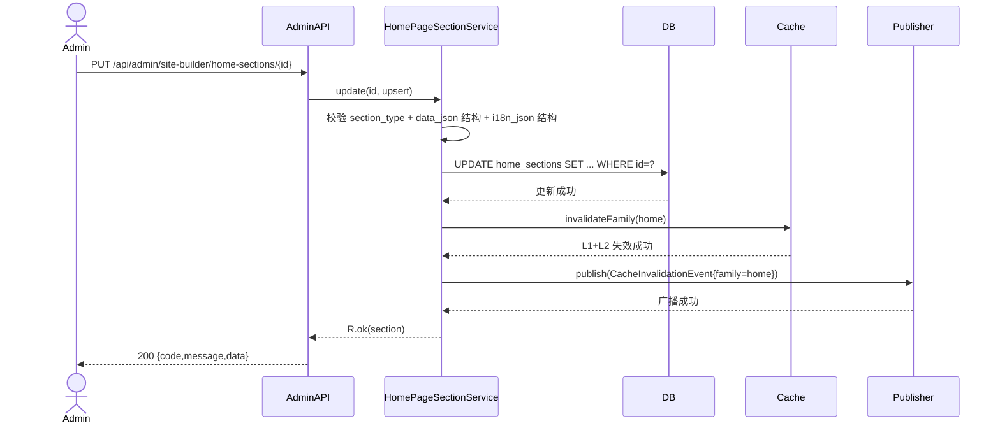
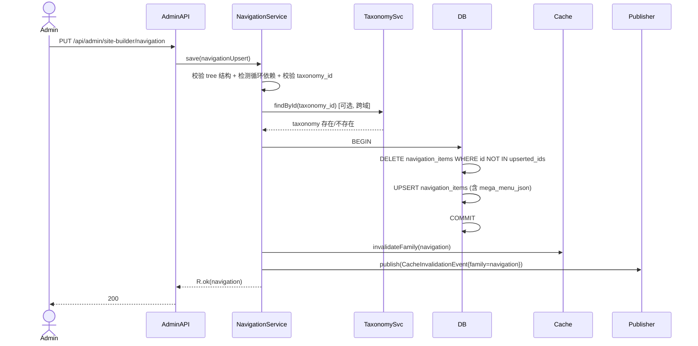
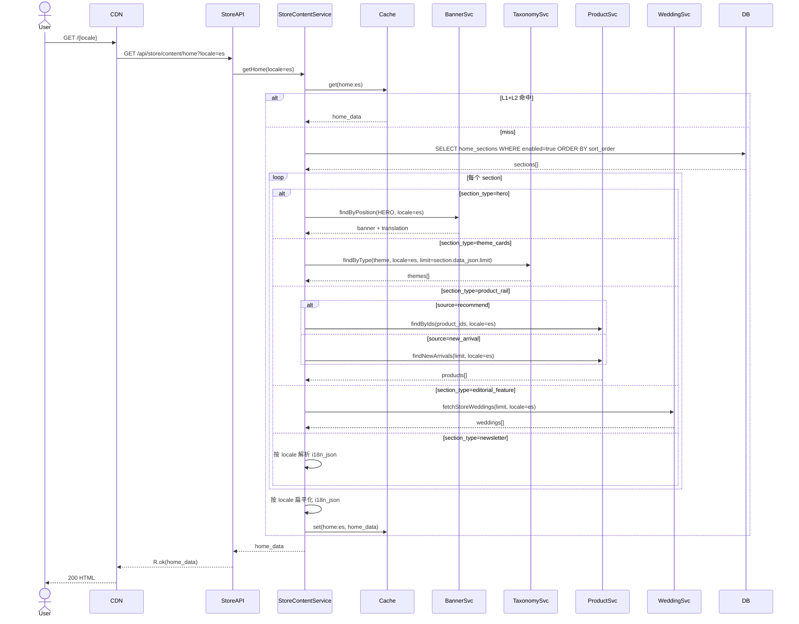
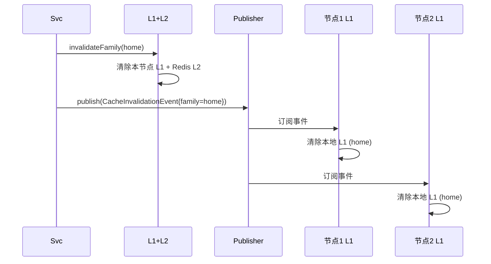

# 数据流 - site-decoration-fullstack（增量）

本文档定义 site-decoration-fullstack 变更新增的 site_builder 限界上下文（KD-15）的数据流转，覆盖 HomeBuilder / NavigationConfig / Announcement 三页后台 CRUD、消费端首页动态渲染、header/footer/公告条全量改造、Newsletter 订阅扩展、缓存失效链等场景。逐条响应 `decision.md` KD-1~KD-17 与 `boundary-scenarios.yml` 边界场景。与 baseline 各域 data-flow.md 并列（baseline 无 site_builder 域，本变更新增）。

**参与者命名**：
- `Admin`（portal-admin Vue3 运营）
- `User`（portal-store Next.js 消费端登录用户）
- `Guest`（匿名访客）
- `AdminAPI`（AdminHomePageSectionController / AdminNavigationController / AdminFooterController / AdminAnnouncementController）
- `StoreAPI`（StoreContentController 扩展 + 基线 NewsletterController 扩展）
- `Svc`（site_builder 域服务：HomePageSectionService / NavigationService / FooterService / AnnouncementService / StoreContentService）
- `DB`（MySQL：home_sections / navigation_items / footer_columns / footer_links / announcements 新表，banner / banner_translations / taxonomy / product / weddings / newsletter_subscriber 基线表）
- `Cache`（JetCache Redis + in-process Caffeine 两级缓存）
- `Publisher`（Redis pub/sub 广播缓存失效事件，KD-1/GRD-W01）
- `BannerSvc` / `TaxonomySvc` / `ProductSvc` / `WeddingSvc` / `SubscriberSvc`（跨域调用）
- `CDN`（Cloudflare 边缘）
- `Middleware`（Next.js middleware locale 检测）

## 各层数据转换约定（增量）

| 边界 | 转换 | 说明 |
|------|------|------|
| AdminAPI ⇄ Svc | Request DTO（@Valid 校验）⇄ 领域入参；响应装入 R 包络 `{code,message,data}` | i18n_json 字段：整体透传 JSON 对象（`{en:{...}, es:{...}, fr:{...}}`），Svc 内部按 locale 解析或整体持久化 |
| Svc ⇄ DB | Entity.i18n_json（JSON 列）⇄ 领域对象；主表 `label`/`title`/`content` 列同步存 EN 基准值 | i18n_json 结构：`{en:{...}, es:{...}, fr:{...}}`；EN 为基准，主表字段冗余 EN 值便于查询（KD-16） |
| StoreAPI ⇄ Svc | Request（locale 参数从 URL 路径或 Accept-Language 提取）⇄ 领域入参；响应按 locale 扁平化 | 消费端响应将 i18n_json 按 locale 解析后返回扁平字符串字段（如 `title`/`content`/`label`） |
| 跨域调用（Hero → Banner） | Svc 调 BannerService.findByPosition(HERO) | 返回 Banner + BannerTranslation，site_builder 不持有 Banner 实体，仅运行时派生 Hero 数据（KD-2） |
| 跨域调用（Navigation → Taxonomy） | NavigationItem.taxonomy_id（可选）→ TaxonomyService.findById | 仅校验存在性，不加载 Taxonomy 实体到导航响应 |
| 跨域调用（ProductRail → Product） | HomePageSection.data_json.product_ids[] → ProductService.findByIds | 批量查询，按 sort_order 排序返回 |
| 跨域调用（EditorialFeature → Wedding） | HomePageSection.data_json.limit + 可选 wedding_ids → WeddingService.fetchStoreWeddings | 复用基线 fetchStoreWeddings API |
| 跨域调用（Newsletter → Subscriber） | POST /api/store/newsletter source=HOME_BLOCK → SubscriberService.subscribe | 扩展基线端点（KD-13），复用 NewsletterSubscriber 持久化 |
| 缓存失效链 | admin 写操作 → cache.invalidateFamily(family) → publisher.publish(event) → 各节点订阅 → 本地 Caffeine 失效 | in-process 失效，非 HTTP 自调（KD-1/GRD-W01）；family 粒度：home / navigation / footer / announcement |
| 消费端 locale 路由 | URL `/es/...` → middleware 提取 locale=es → SSR context | EN 为根路径，ES/FR 为 `/es/`、`/fr/` 前缀（复用 baseline 约定） |
| i18n_json locale 回退 | i18n_json[locale] 缺失 → 回退 i18n_json.en → 再缺失回退主表 label/title/content | EN 为基准语言（KD-16），三层回退保证消费端永不返回 null |

## 缓存策略

**两级缓存（JetCache + in-process Caffeine）**：
- **L1 in-process Caffeine**：进程本地缓存，5 分钟 TTL，最大 1000 条；按 family 分组（home/navigation/footer/announcement）
- **L2 JetCache Redis**：跨节点共享缓存，30 分钟 TTL，按 family + locale 分 key
- **读取顺序**：L1 命中 → 返回；L1 miss → L2 命中 → 回填 L1 → 返回；L2 miss → DB → 回填 L1+L2

**缓存失效链（KD-4 保存即发布）**：
1. admin 写操作提交事务后，同事务内调用 `cache.invalidateFamily(family)`
2. 失效 L1（本节点）+ L2（Redis）
3. 通过 `publisher.publish(CacheInvalidationEvent)` 广播到所有节点
4. 各节点订阅事件 → 失效本地 L1
5. 下一次消费端读取触发缓存重建

**Family 分组**：
- `home`：HomePageSection 全部 + Hero Banner 派生数据
- `navigation`：NavigationItem 全部
- `footer`：FooterColumn + FooterLink 全部
- `announcement`：Announcement 全部

**失败处理**：
- 缓存失效失败：记录 ERROR 日志，不阻断主流程（最终一致性，下一次读会触发刷新）
- 缓存读取异常：降级直读 DB，记录 WARN 日志

## 核心业务流程清单

| 流程编号 | 流程名称 | 域 | 触发条件 | 参与模块 | 验收 |
|---------|---------|----|---------|---------|-----|
| FLOW-SB01 | 后台保存首页区块 | site_builder | 后台 HomeBuilder 页编辑区块 → 保存 | Admin, AdminAPI, Svc, DB, Cache, Publisher | FUNC-001~003, 决策 KD-4/KD-16, EDGE-001~005 |
| FLOW-SB02 | 后台保存导航配置 | site_builder | 后台 NavigationConfig 页编辑 → 保存 | Admin, AdminAPI, Svc, DB, Cache, Publisher | FUNC-004~006, 决策 KD-4/KD-6, EDGE-006~010 |
| FLOW-SB03 | 后台保存页脚配置 | site_builder | 后台 FooterConfig 页编辑 → 保存 | Admin, AdminAPI, Svc, DB, Cache, Publisher | FUNC-007~008, 决策 KD-4/KD-16, EDGE-011~012 |
| FLOW-SB04 | 后台公告条 CRUD | site_builder | 后台 AnnouncementConfig 页 → 创建/更新/删除/启停 | Admin, AdminAPI, Svc, DB, Cache, Publisher | FUNC-009~011, 决策 KD-7/KD-17, EDGE-013~015 |
| FLOW-SB05 | 消费端首页动态渲染 | site_builder + 跨域 | 用户访问 `/` 或 `/es` 或 `/fr` | User/Guest, CDN, StoreAPI, Svc, BannerSvc, TaxonomySvc, ProductSvc, WeddingSvc, DB, Cache | FUNC-012~014, 决策 KD-2/KD-5/KD-8/KD-9/KD-10/KD-16, EDGE-016~020 |
| FLOW-SB06 | 消费端 header 渲染 | site_builder | 任意消费端页面加载 | User/Guest, CDN, StoreAPI, Svc, Cache | FUNC-015, 决策 KD-5/KD-6, EDGE-021 |
| FLOW-SB07 | 消费端 footer 渲染 | site_builder | 任意消费端页面加载 | User/Guest, CDN, StoreAPI, Svc, Cache | FUNC-016, 决策 KD-5, EDGE-022 |
| FLOW-SB08 | 消费端公告条渲染 | site_builder | 任意消费端页面加载（顶部） | User/Guest, CDN, StoreAPI, Svc, Cache | FUNC-017, 决策 KD-7/KD-17, EDGE-023 |
| FLOW-SB09 | Newsletter 订阅 | site_builder + identity | 首页 Newsletter 区块提交邮箱 | User/Guest, StoreAPI, Svc, SubscriberSvc, DB | FUNC-018, 决策 KD-11/KD-13, EDGE-024 |
| FLOW-SB10 | 缓存失效广播 | site_builder | admin 任意写操作后 | Svc, Cache, Publisher, 各节点 | 决策 KD-1/KD-4, GRD-W01 |

## 决策响应映射

| 决策 | 本文档响应位置 |
|------|---------------|
| KD-1 Publish.vue 不改造 | FLOW-SB10 缓存失效链（in-process，非 HTTP 自调） |
| KD-2 Hero 区块复用 Banner | FLOW-SB05 跨域调用 BannerSvc.findByPosition(HERO) |
| KD-4 保存即发布 | FLOW-SB01~SB04 写操作后立即触发缓存失效 |
| KD-5 消费端全量改造 | FLOW-SB05~SB08 消费端首页/header/footer/公告条 |
| KD-6 Mega Menu JSON 列 | FLOW-SB02 navigation_items.mega_menu_json |
| KD-7 公告独立域 | FLOW-SB04/SB08 Announcement 独立 CRUD + 渲染 |
| KD-8 ThemeCards 引用 taxonomy | FLOW-SB05 跨域调用 TaxonomySvc.findByType(theme) |
| KD-9 ProductRail 人工推荐 | FLOW-SB05 跨域调用 ProductSvc.findByIds(product_ids) |
| KD-10 EditorialFeature 引用 weddings | FLOW-SB05 跨域调用 WeddingSvc.fetchStoreWeddings |
| KD-11 Newsletter 完整订阅 | FLOW-SB09 扩展基线 /api/store/newsletter |
| KD-13 扩展基线 newsletter | FLOW-SB09 source=HOME_BLOCK(4) |
| KD-14 Banner 新增 cta_*_secondary | FLOW-SB05 Hero 派生数据含 secondary CTA |
| KD-15 新建 site_builder 域 | FLOW-SB01~SB10 全部为本变更新增 |
| KD-16 i18n_json JSON 列 | 各层数据转换约定 i18n_json 列结构 |
| KD-17 Breaking change TOPBAR 废弃 | FLOW-SB08 公告独立读取，不再 fetchStoreBanners(TOPBAR) |

---

## FLOW-SB01: 后台保存首页区块

**触发条件**: 后台运营在 HomeBuilder 页面编辑区块（启用/禁用、排序、data_json 配置、i18n_json 多语言文案）→ 点击保存。

**关键步骤**：
1. STEP-01：入参校验（V-001~V-005）— section_type 合法、data_json 符合 type 对应 schema、i18n_json 结构 `{en,es,fr}`、enabled 为 boolean、sort_order 非负
2. STEP-02：事务开启（TX-001）
3. STEP-03：UPDATE home_sections（含 data_json、i18n_json、enabled、sort_order）
4. STEP-04：事务提交前触发 cache.invalidateFamily(home)
5. STEP-05：事务提交
6. STEP-06：事务外 publisher.publish 广播失效事件
7. STEP-07：异常路径：DB 异常 → 事务回滚 → 不触发缓存失效 → 500801 INTERNAL_ERROR

**边界场景**：
- EDGE-001：i18n_json 缺失 es/fr → 接受（EN 为基准，回退策略）
- EDGE-002：data_json 字段缺失 → 422801 FIELD_VALIDATION_FAILED
- EDGE-003：section_type 不在枚举 → 422802
- EDGE-004：sort_order 重复 → 接受（前端按 sort_order 排序，同序按 id）
- EDGE-005：并发更新（乐观锁）→ 409801 HOME_SECTION_SORT_CONFLICT

---

## FLOW-SB02: 后台保存导航配置

**触发条件**: 后台 NavigationConfig 页编辑导航项（含 mega_menu_json）→ 整体保存（KD-4 保存即发布）。

**关键步骤**：
1. STEP-01：入参校验（V-006~V-010）— tree 结构合法、parent_id 无环、label_key 非空、url 格式、target 枚举、mega_menu_json 结构
2. STEP-02：循环依赖检测（CV-001）— DFS 检测 parent_id 链，发现环 → 409802 NAVIGATION_ITEM_CYCLE_DETECTED
3. STEP-03：跨域校验 taxonomy_id 存在性（若 NavigationItem.taxonomy_id 非空）
4. STEP-04：事务开启（TX-002）
5. STEP-05：DELETE 已移除的 navigation_items
6. STEP-06：UPSERT 保留的和新增的 navigation_items（含 mega_menu_json）
7. STEP-07：事务提交前触发 cache.invalidateFamily(navigation)
8. STEP-08：事务提交
9. STEP-09：事务外 publisher.publish
10. STEP-10：异常路径：循环依赖 → 409802；taxonomy 不存在 → 404805 TAXONOMY_NOT_FOUND（跨域）；DB 异常 → 500801

**边界场景**：
- EDGE-006：parent_id 形成环 → 409802
- EDGE-007：mega_menu_json 为 null → 接受（非 mega menu 项）
- EDGE-008：taxonomy_id 指向不存在的分类 → 404805
- EDGE-009：整体替换时 id 缺失 → 视为新增
- EDGE-010：并发保存（乐观锁 version）→ 409805 NAVIGATION_VERSION_CONFLICT

---

## FLOW-SB03: 后台保存页脚配置

**触发条件**: 后台 FooterConfig 页编辑栏目和链接 → 整体保存。

**关键步骤**：
1. STEP-01：校验 columns 和 links 结构
2. STEP-02：校验 column_id 引用完整性（links.column_id 必须在 columns 中存在）
3. STEP-03：事务（TX-003）— DELETE footer_columns + footer_links → UPSERT 全量
4. STEP-04：cache.invalidateFamily(footer) + publisher.publish
5. STEP-05：异常 → 500801 或 409803 FOOTER_COLUMN_SORT_CONFLICT

**边界场景**：
- EDGE-011：column_id 引用不存在 → 422803
- EDGE-012：link.url 格式非法 → 422804

---

## FLOW-SB04: 后台公告条 CRUD

**触发条件**: 后台 AnnouncementConfig 页创建/更新/删除/启停公告。

**关键步骤**：
1. STEP-01：校验 content_i18n_json 结构 + 时间窗（start_at < end_at）
2. STEP-02：唯一性校验 — 同 priority + 时间窗重叠 → 409804 ANNOUNCEMENT_TIME_WINDOW_CONFLICT
3. STEP-03：事务（TX-004）— INSERT/UPDATE/DELETE announcements
4. STEP-04：cache.invalidateFamily(announcement) + publisher.publish
5. STEP-05：异常 → 500801 或对应 4xx

**边界场景**：
- EDGE-013：时间窗 start_at >= end_at → 422805
- EDGE-014：同 priority 时间窗重叠 → 409804
- EDGE-015：启用状态切换不影响时间窗外可见性 → 接受

---

## FLOW-SB05: 消费端首页动态渲染

**触发条件**: 用户访问 `/`、`/es`、`/fr` 首页。

**关键步骤**：
1. STEP-01：从 cache 读取 `home:{locale}`
2. STEP-02：miss 时查 DB — `SELECT * FROM home_sections WHERE enabled=true ORDER BY sort_order, id`
3. STEP-03：按 section_type 派生数据：
   - hero → BannerSvc.findByPosition(HERO, locale)（KD-2）
   - theme_cards → TaxonomySvc.findByType(theme, locale, limit)（KD-8）
   - product_rail → ProductSvc.findByIds 或 findNewArrivals（KD-9）
   - editorial_feature → WeddingSvc.fetchStoreWeddings(limit, locale)（KD-10）
   - newsletter → 仅 i18n_json 文案，无跨域
   - custom → 仅 i18n_json + data_json
4. STEP-04：按 locale 扁平化 i18n_json（三层回退：locale → en → 主表字段）
5. STEP-05：写入 cache `home:{locale}`
6. STEP-06：异常路径：
   - BannerSvc 失败 → 502801，省略 Hero 区块 + WARN 日志
   - TaxonomySvc 失败 → 502802，降级返回空 themes
   - ProductSvc 失败 → 502804，降级返回空 products
   - WeddingSvc 失败 → 502803，降级返回空 weddings
   - DB 异常 → 500801

**边界场景**：
- EDGE-016：所有 section disabled → 返回空数组
- EDGE-017：Hero Banner 不存在 → 省略 Hero 区块（不报错）
- EDGE-018：i18n_json[locale] 缺失 → 回退 en，再回退主表 label
- EDGE-019：跨域服务全部失败 → 仍返回 custom 类型 section
- EDGE-020：cache 失效窗口期并发重建 → 用 singleflight 防击穿

---

## FLOW-SB06: 消费端 header 渲染

**触发条件**: 任意消费端页面加载，layout.tsx 调用 GET /api/store/content/navigation?locale=xx。

**关键步骤**：
1. STEP-01：从 cache 读取 `navigation:{locale}`
2. STEP-02：miss 时查 DB — `SELECT * FROM navigation_items WHERE enabled=true ORDER BY sort_order, id`，组装树结构
3. STEP-03：按 locale 扁平化 i18n_json
4. STEP-04：写入 cache
5. STEP-05：异常 → 500801 或 502802（taxonomy 跨域校验失败降级）

**边界场景**：
- EDGE-021：所有 navigation_items disabled → 返回空树

---

## FLOW-SB07: 消费端 footer 渲染

**触发条件**: 任意消费端页面加载，layout.tsx 调用 GET /api/store/content/footer?locale=xx。

**关键步骤**：
1. STEP-01：cache 读取 `footer:{locale}`
2. STEP-02：miss 时查 DB — `SELECT * FROM footer_columns + footer_links`，组装 columns + links 结构
3. STEP-03：按 locale 扁平化 i18n_json
4. STEP-04：写入 cache
5. STEP-05：异常 → 500801

**边界场景**：
- EDGE-022：footer 为空 → 返回空 columns 数组

---

## FLOW-SB08: 消费端公告条渲染

**触发条件**: 任意消费端页面加载（顶部），layout.tsx 调用 GET /api/store/content/announcements?locale=xx。

**关键步骤**：
1. STEP-01：cache 读取 `announcement:{locale}`
2. STEP-02：miss 时查 DB — `SELECT * FROM announcements WHERE enabled=true AND (start_at IS NULL OR start_at<=NOW()) AND (end_at IS NULL OR end_at>=NOW()) ORDER BY priority DESC, id`
3. STEP-03：按 locale 扁平化 content_i18n_json + i18n_json
4. STEP-04：写入 cache
5. STEP-05：异常 → 500801

**边界场景**：
- EDGE-023：无有效公告 → 返回空数组（不报错）

---

## FLOW-SB09: Newsletter 订阅

**触发条件**: 首页 Newsletter 区块提交邮箱。

**关键步骤**：
1. STEP-01：入参校验 — email 格式、locale 合法
2. STEP-02：跨域调用 SubscriberService.subscribe(email, source=HOME_BLOCK(4), locale)
3. STEP-03：SubscriberService 持久化到基线 newsletter_subscriber 表（KD-13）
4. STEP-04：异常路径：
   - email 重复 → 409704（沿用 marketing 域错误码）
   - email 格式非法 → 422704
   - SubscriberService 失败 → 500705

**边界场景**：
- EDGE-024：重复订阅 → 返回成功（幂等，避免泄露订阅状态）

---

## FLOW-SB10: 缓存失效广播

**触发条件**: FLOW-SB01~SB04 任意 admin 写操作后。

**关键步骤**：
1. STEP-01：admin 写操作事务提交前，同事务内 cache.invalidateFamily(family)
2. STEP-02：失效本节点 L1（Caffeine）+ L2（Redis JetCache）
3. STEP-03：事务提交
4. STEP-04：事务外 publisher.publish（Redis pub/sub）
5. STEP-05：各节点订阅事件 → 失效本地 L1
6. STEP-06：下一次消费端读触发缓存重建

**失败处理**：
- publisher.publish 失败：记录 ERROR 日志，不阻断主流程（最终一致性）
- 订阅节点失败：该节点 L1 可能脏，但 L2 已失效，下次读会从 DB 重建
- 整体原则：缓存一致性最终一致，不追求强一致

**GRD-W01 修正**：缓存失效为 in-process 调用（cache.invalidateFamily + publisher.publish），**非 HTTP 自调**（如不调用 /api/admin/cache/invalidate 端点）。

---

## 边界场景覆盖汇总

| 场景 | 流程 | 处理策略 |
|------|------|----------|
| EDGE-001 i18n_json 部分缺失 | FLOW-SB01 | 接受，EN 为基准 |
| EDGE-002 data_json 字段缺失 | FLOW-SB01 | 422801 拒绝 |
| EDGE-003 section_type 非法 | FLOW-SB01 | 422802 拒绝 |
| EDGE-004 sort_order 重复 | FLOW-SB01 | 接受，按 id 次序 |
| EDGE-005 并发更新 | FLOW-SB01 | 409801 乐观锁 |
| EDGE-006 导航 parent_id 环 | FLOW-SB02 | 409802 拒绝 |
| EDGE-007 mega_menu_json null | FLOW-SB02 | 接受 |
| EDGE-008 taxonomy_id 不存在 | FLOW-SB02 | 404805 拒绝 |
| EDGE-009 整体替换 id 缺失 | FLOW-SB02 | 视为新增 |
| EDGE-010 导航并发保存 | FLOW-SB02 | 409805 乐观锁 |
| EDGE-011 column_id 引用缺失 | FLOW-SB03 | 422803 拒绝 |
| EDGE-012 link.url 格式非法 | FLOW-SB03 | 422804 拒绝 |
| EDGE-013 公告时间窗颠倒 | FLOW-SB04 | 422805 拒绝 |
| EDGE-014 公告 priority+时间窗冲突 | FLOW-SB04 | 409804 拒绝 |
| EDGE-015 公告启停不影响时间窗 | FLOW-SB04 | 接受 |
| EDGE-016 所有 section disabled | FLOW-SB05 | 返回空数组 |
| EDGE-017 Hero Banner 不存在 | FLOW-SB05 | 省略 Hero 区块 |
| EDGE-018 i18n locale 缺失 | FLOW-SB05 | 三层回退 |
| EDGE-019 跨域全失败 | FLOW-SB05 | 仅返回 custom |
| EDGE-020 缓存击穿 | FLOW-SB05 | singleflight |
| EDGE-021 所有导航 disabled | FLOW-SB06 | 返回空树 |
| EDGE-022 footer 为空 | FLOW-SB07 | 返回空 columns |
| EDGE-023 无有效公告 | FLOW-SB08 | 返回空数组 |
| EDGE-024 重复 Newsletter 订阅 | FLOW-SB09 | 幂等成功 |
