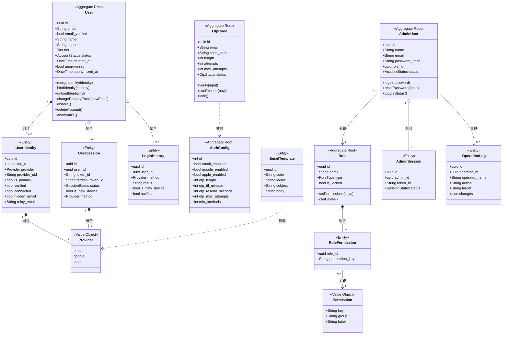
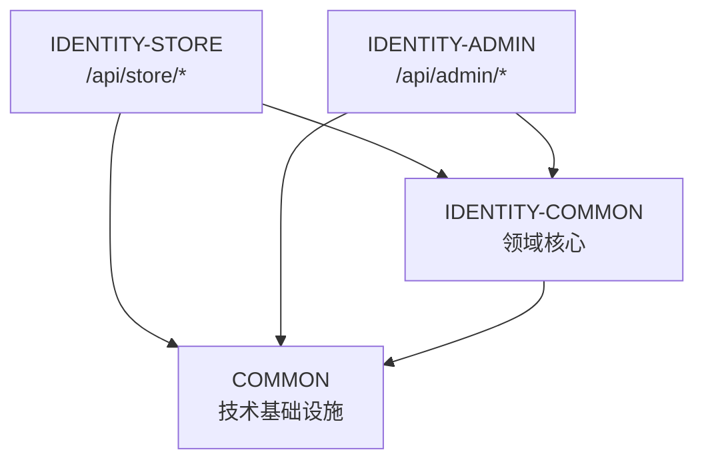

# 领域模型 - identity（身份认证与用户域）

## 概述

本文档定义 `identity` 限界上下文的领域模型。该上下文为**单一限界上下文，跨 portal-store（消费端）与 portal-admin（后台）两个表现层**，承载消费端 passwordless 登录、多渠道认证（Email OTP / Google OIDC / Apple OIDC）、账户安全（绑定/解绑/会话管理）、后台管理员登录与菜单级 RBAC、用户身份运营、认证配置、操作审计、数据保留合规等全部能力。

核心建模原则（依据 decision.md 决策 3）：以 **User（自然人）** 为 canonical 聚合根，1:N 持有 **UserIdentity（登录凭证）**；识别同一人靠 `(provider, provider_uid)` 而非 email。后台侧以 **AdminUser** 为聚合根，通过 **Role × Permission** 二元矩阵实现菜单级 RBAC。

实体来源：`er-diagram.yml`（13 个实体，权威）。本模型为 Bootstrap 模式从零设计，`meta.mode: bootstrap`。

> 注：所有实体唯一标识建模为 `uuid`（与 er-diagram.yml 一致；`permission` 以 `key` 为业务主键，`auth_config` 为单例 `int` 主键）。落地基类（如 LongAuditableEntity）由 L3 按技术栈选型决定，本层仅定义领域语义。

## 聚合划分总览

| 聚合根 | 聚合内实体 | 聚合职责 |
|--------|-----------|----------|
| **User** | UserIdentity, UserSession（通过 ID 引用，弱聚合） | 自然人账户、登录凭证集合、活跃会话生命周期、账户状态机（active/disabled/deleted/anonymized） |
| **AdminUser** | AdminSession（弱聚合） | 后台操作员账户、后台会话 |
| **Role** | RolePermission（组合） | 角色及其菜单权限集合，超管 is_locked 不变量 |
| **OtpCode**（独立聚合） | — | OTP 生命周期与频控/锁定不变量 |
| **AuthConfig**（单例聚合） | — | 全局认证配置（开关/OTP 策略/min_methods/OAuth 凭据） |
| **LoginHistory**（追加型实体） | — | 登录审计追加记录 |
| **OperationLog**（追加型实体） | — | 后台操作审计追加记录，只读不可删 |
| **EmailTemplate**（配置实体） | — | 三语邮件模板 |
| **Permission**（引用数据） | — | 菜单权限点字典（22 项菜单 key） |

> 聚合边界说明：UserSession / UserIdentity 虽与 User 强相关，但出于独立生命周期、按 token 点查与强制下线需求，建模为**通过 user_id 引用的独立持久化实体**，不作为 User 的内聚集合强约束加载。User 聚合根仍负责维护跨这些实体的业务不变量（如解绑后 connected ≥ min_methods、主邮箱不可解绑）。

## 聚合根

### User（自然人账户）

- **职责**: 代表唯一自然人；持有多个登录凭证（UserIdentity）与活跃会话（UserSession）；维护账户生命周期与归并不变量。
- **不变量**:
  - 同一 `(provider, provider_uid)` 全局唯一，只能挂在一个 User 下（防账户劫持）。
  - 至少保留一个 `connected=true` 的 UserIdentity，且解绑后 connected 数 ≥ `AuthConfig.min_methods`。
  - 有且仅有一个 `is_primary=true` 的 UserIdentity（主邮箱凭证）。
  - 主邮箱凭证不可解绑（须先 change_primary 迁移）。
  - 自动归并仅当 `email_verified=true` 且邮箱与既有 User 一致时发生；冲突即拒，不静默合并。
- **生命周期**: `active → disabled`（管理员禁用，级联撤销全部会话）；`active/disabled → deleted`（本人注销软删除，记 deleted_at，撤销全部会话）；`deleted → anonymized`（超 30 天宽限定时任务，PII 不可逆匿名化）。

**属性**:
- `id`: uuid - 唯一标识
- `email`: string(required) - 主邮箱（匿名化后清空）
- `email_verified`: bool(required) - 主邮箱是否已验证（归并判定关键）
- `name`: string(maxlen 80) - 姓名
- `phone`: string(maxlen 32) - 电话
- `tier`: enum[vip, regular](required) - 会员等级
- `status`: enum[active, disabled, deleted](required) - 账户状态（anonymized 由匿名化任务置位，见状态机）
- `avatar`: string - 头像 URL
- `joined_at`: datetime - 注册时间
- `deleted_at`: datetime - 软删除时间
- `anonymized`: bool - 是否已匿名化
- `anonymized_at`: datetime - 匿名化时间
- `created_at` / `updated_at`: datetime

**方法**:
- `mergeIdentity(identity)`: 自动归并新凭证（email_verified 且邮箱一致）
- `bindIdentity(identity)`: 绑定新登录方式（校验 provider_uid 未被占用）
- `unbindIdentity(identityId)`: 解绑（校验非主、剩余 ≥ min_methods）
- `changePrimaryEmail(newEmailIdentity)`: 迁移 is_primary 到新邮箱凭证
- `disable()` / `enable()`: 禁用/启用（禁用级联撤销会话）
- `deleteAccount()`: 注销软删除并撤销全部会话
- `anonymize()`: 不可逆匿名化 PII

### AdminUser（后台操作员）

- **职责**: 后台管理员账户，持有 Role 引用与后台会话；密码登录。
- **不变量**:
  - email 全局唯一，创建后不可改。
  - password_hash 仅存哈希；密码 ≥ 6 位。
  - 超级管理员（其 Role.is_locked=true）不可被禁用、不可被删除、不可降权。
  - 不可删除自己。
- **生命周期**: `active ↔ disabled`（行内切换，目标非超管）。

**属性**:
- `id`: uuid - 唯一标识
- `name`: string(required, maxlen 80)
- `email`: string(required) - 唯一，不可改
- `password_hash`: string(required) - 仅哈希
- `role_id`: ref→Role(required)
- `status`: enum[active, disabled](required)
- `last_login_at`: datetime
- `created_at`: datetime

**方法**: `login(password)`、`resetPassword(newHash)`、`toggleStatus()`、`assignRole(roleId)`

### Role（角色）

- **职责**: 角色定义及其菜单权限集合（通过 RolePermission 组合）。
- **不变量**:
  - 预设超级管理员 `is_locked=true`，拥有全部权限，不可编辑权限/删除/降权。
  - 角色下仍有关联 AdminUser 时不可删除（ROLE_IN_USE）。
- **生命周期**: 自定义角色可新增/改名/删除；预设角色不可删。

**属性**:
- `id`: uuid - 唯一标识
- `name`: string(required, maxlen 40)
- `type`: enum[preset, custom](required)
- `is_locked`: bool(required)
- `created_at`: datetime

**方法**: `rename(name)`、`setPermissions(keys[])`、`canDelete()`（无关联成员）

### OtpCode（一次性验证码）

- **职责**: 维护单次 OTP 的状态机、过期与失败锁定不变量；仅存哈希。
- **不变量**:
  - `code_hash` 仅存哈希，绝不存明文。
  - `attempts` 单调递增，达 `max_attempts` 即 locked。
  - `now > expires_at` 即 expired。
  - 重发需 `now - last_sent_at >= AuthConfig.otp_resend_seconds`，覆盖旧码并重置 attempts。
- **生命周期**: `pending → consumed / expired / locked`（详见 state-machine）。

**属性**:
- `id`: uuid - 唯一标识
- `email`: string(required)
- `code_hash`: string(required) - 仅哈希
- `length`: enum[4,6,8](required)
- `expires_at`: datetime(required)
- `attempts`: int(required, min 0)
- `max_attempts`: int(required, 3..10)
- `status`: enum[pending, consumed, expired, locked](required)
- `last_sent_at`: datetime
- `created_at`: datetime

**方法**: `verify(input)`、`incrementAttempt()`、`lock()`、`expire()`、`canResend(now)`

### AuthConfig（单例认证配置）

- **职责**: 全局认证策略单例：登录方式开关、OTP 策略、min_methods、OAuth 凭据展示。
- **不变量**: email 主登录恒开不可关；OTP 数值越界（ttl>30、attempts<3 等）保存被拒。
- **生命周期**: 仅更新（单例）；保存写 action=认证配置变更 OperationLog 并触发缓存失效。

**属性**:
- `id`: int(pk, 单例)
- `email_enabled` / `google_enabled` / `apple_enabled`: bool(required)
- `otp_length`: enum[4,6,8](required)
- `otp_ttl_minutes`: int(required, 1..30)
- `otp_resend_seconds`: int(required, 10..120)
- `otp_max_attempts`: int(required, 3..10)
- `min_methods`: int(required, 1..3)
- `google_client_id` / `apple_service_id`: string(只读展示)
- `updated_at`: datetime

## 实体

### UserIdentity（登录凭证）

- **归属聚合**: User
- **职责**: 一条登录凭证；以 `(provider, provider_uid)` 唯一识别自然人。
- **不变量**: `(provider, provider_uid)` 全局唯一；Apple Hide My Email 以 OIDC `sub` 为 provider_uid，relay 邮箱存 `relay_email`，relay 失效不锁死账户（sub 仍稳定主键）。

**属性**: `id`(uuid pk)、`user_id`(ref→User required)、`provider`(enum[email,google,apple] required)、`provider_uid`(string required)、`identifier`(string 展示用)、`is_primary`(bool required)、`verified`(bool required)、`connected`(bool required)、`hidden_email`(bool)、`relay_email`(string)、`bound_at`(datetime)、`last_login_at`(datetime)

### UserSession（消费端会话）

- **归属聚合**: User（弱聚合，ID 引用）
- **职责**: 消费端 store JWT 会话；access 2h + refresh 30d 滑动续期，refresh 可撤销。
- **不变量**: `status=revoked` 后 token/refresh 立即失效；每次授权以 DB 状态为准，Redis 兼容键不影响撤销语义。

**属性**: `id`(uuid pk)、`user_id`(ref→User required)、`token_id`(string required, =jti)、`refresh_token_id`(string)、`access_expires_at`、`refresh_expires_at`、`device`、`browser`、`ip`、`location`、`is_new_device`(bool)、`method`(enum[email,google,apple] required)、`status`(enum[active,revoked] required)、`last_active_at`、`created_at`

### AdminSession（后台会话）

- **归属聚合**: AdminUser（弱聚合）
- **职责**: 后台 admin JWT 会话；access 8h 无 refresh。
- **不变量**: admin 账户被禁用即级联 revoked。

**属性**: `id`(uuid pk)、`admin_id`(ref→AdminUser required)、`token_id`(string required)、`ip`、`device`、`status`(enum[active,revoked] required)、`last_active_at`、`created_at`

### RolePermission（角色-权限关联）

- **归属聚合**: Role（组合，生命周期随 Role）
- **职责**: Role × Permission(菜单 key) 二元矩阵的一条记录。

**属性**: `role_id`(ref→Role required)、`permission_key`(ref→Permission required)

### LoginHistory（登录记录，追加型）

- **职责**: 登录成功/失败审计；新设备通知标记。保留 1 年后清理。
- **特征**: 追加写入，不修改（notified 字段除外）。

**属性**: `id`(uuid pk)、`user_id`(ref→User)、`email`(string)、`method`(enum required)、`ip`、`device`、`location`、`result`(enum[success,failed] required)、`is_new_device`(bool)、`notified`(bool)、`created_at`(required)

### OperationLog（操作日志，追加型，只读不可删）

- **职责**: 后台关键操作全量审计，含变更前后对比（changes JSON）。保留 1–3 年，注销不删（正当利益）。
- **特征**: 只读不可删，无 update/delete 接口。账户归并由系统自动写入（operator=系统）。

**属性**: `id`(uuid pk)、`operator_id`(ref→AdminUser)、`operator_name`(string required)、`action`(enum：登录/Google 登录/Apple 登录/创建管理员/编辑管理员/删除管理员/禁用管理员/重置密码/创建角色/编辑角色/删除角色/权限变更/账户合并/强制下线/认证配置变更, required)、`target`(string)、`ip`、`user_agent`、`changes`(json)、`created_at`(required)

### EmailTemplate（邮件模板，配置实体）

- **职责**: 三语（EN/ES/FR）邮件模板：otp / new_device / change_primary / account_deleted。

**属性**: `id`(uuid pk)、`code`(enum[otp,new_device,change_primary,account_deleted] required)、`locale`(enum[en,es,fr] required)、`subject`(string required)、`body`(string required)、`updated_at`

## 值对象

### Provider（认证提供方）

- **用途**: 标识登录渠道。
- **不变性**: 枚举不可变。
- **取值**: `email` | `google` | `apple`

### AccountStatus / SessionStatus / OtpStatus（状态枚举）

- **用途**: 各聚合状态机的状态值。
- **取值**:
  - AccountStatus: `active` | `disabled` | `deleted` | `anonymized`
  - SessionStatus: `active` | `revoked`
  - OtpStatus: `pending` | `consumed` | `expired` | `locked`

### TokenPair（JWT 令牌对，store 端）

- **用途**: 封装 access + refresh token 及过期时间。
- **不变性**: 签发后不可变；续期生成新实例。
- **属性**: `access_token`、`refresh_token`、`access_expires_at`、`refresh_expires_at`

## 领域模型图

## 关系说明

### User 与 UserIdentity

- **关系类型**: 组合（生命周期绑定，匿名化时凭证一并匿名化）
- **多重性**: 1:N（≥1，至少保留 min_methods 个 connected）
- **说明**: 一个自然人持有多种登录凭证；识别靠 `(provider, provider_uid)`。

### User 与 UserSession

- **关系类型**: 聚合（会话独立持久化，弱拥有）
- **多重性**: 1:N
- **说明**: 不限会话数；禁用/注销级联撤销；会话有效性始终以 DB 状态为准。

### Role 与 Permission（经 RolePermission）

- **关系类型**: 多对多（经 RolePermission 关联表）
- **多重性**: N:M
- **说明**: 菜单级二元 RBAC；超管 Role 隐式拥有全部 22 项 permission key。

### AdminUser 与 Role

- **关系类型**: 关联
- **多重性**: N:1
- **说明**: 每个管理员归属一个角色；角色有成员时不可删。

## 业务规则

### 规则 R1：自动账户归并

- **规则描述**: 第三方/邮箱登录时，若 `email_verified=true` 且邮箱与既有 User 一致，系统在单事务内将新 UserIdentity 挂到既有 User 并写 action=账户合并 日志；email 未验证或冲突时返回 409 EMAIL_CONFLICT_UNVERIFIED，不静默合并。
- **涉及实体**: User, UserIdentity, OperationLog
- **验证时机**: 登录/注册回调时

### 规则 R2：解绑约束

- **规则描述**: 主邮箱凭证不可解绑（EDGE-007）；解绑后剩余 connected 数必须 ≥ AuthConfig.min_methods（EDGE-008）。
- **涉及实体**: User, UserIdentity, AuthConfig
- **验证时机**: 解绑请求时

### 规则 R3：超级管理员保护

- **规则描述**: 超管 Role.is_locked=true，不可删/降权/禁用；不可删除自己。
- **涉及实体**: AdminUser, Role
- **验证时机**: 删除/禁用/权限保存时

### 规则 R4：OTP 失败锁定与频控

- **规则描述**: 单码失败达 max_attempts → locked；重发需间隔 ≥ otp_resend_seconds；单 email 5次/时&5次/天、单 IP 20次/时 超限 429。
- **涉及实体**: OtpCode（频控计数在 Redis 窗口，非实体）
- **验证时机**: 发码/校验时

### 规则 R5：会话撤销强一致

- **规则描述**: 强制下线/禁用/注销的 DB 状态提交后全集群即时生效；Redis 兼容键删除失败不形成授权窗口。
- **涉及实体**: UserSession
- **验证时机**: 每次携带 token 的请求

### 规则 R6：数据保留与匿名化

- **规则描述**: OTP 24h 清；revoked 会话 30d 清；LoginHistory 1年清；OperationLog 1–3年（注销不删）；注销 30天宽限后 PII 不可逆匿名化。
- **涉及实体**: OtpCode, UserSession, LoginHistory, OperationLog, User
- **验证时机**: 每日定时任务

---

## 领域边界

本节定义 identity 限界上下文的内部模块边界与依赖关系。本变更为单一限界上下文，内部按表现层与共享层拆分为 4 个逻辑模块（对应后端 common/store/admin 多模块结构）。

### 领域清单

#### IDENTITY-COMMON: 共享领域核心

- **职责**: 承载 identity 全部领域实体、聚合根、领域服务、归并逻辑、JWT 工具、缓存抽象、错误码、邮件/OIDC 集成端口。
- **边界**:
  - 负责: 领域模型（User/UserIdentity/UserSession/OtpCode/AuthConfig/AdminUser/Role/Permission/...）、归并算法、JWT 签发/校验抽象、JetCache 配置、SMTP/OIDC 集成端口、定时数据保留任务、统一错误码与 i18n 文案。
  - 不负责: HTTP 端点暴露（由 STORE/ADMIN 模块负责）、表现层鉴权前缀路由。
- **对外接口**: 领域服务接口（IdentityService、SessionService、OtpService、MergeService、AuthConfigService、AdminService、RoleService、AuditService、RetentionScheduler）。
- **依赖领域**: 无（最底层）。

#### IDENTITY-STORE: 消费端表现层

- **职责**: `/api/store/*` 端点：OTP 登录、OIDC 登录、refresh 续期、账户安全（绑定/解绑/会话/换主邮箱/注销）、资料读取。
- **边界**:
  - 负责: store JWT 签发与校验（独立密钥）、消费端 JetCache 只读缓存、EN/ES/FR i18n、store 路由前缀鉴权。
  - 不负责: 后台管理、RBAC、操作审计写入（审计由 COMMON 提供，store 仅消费端登录/归并触发）。
- **对外接口**: `/api/store/auth/*`、`/api/store/account/*`、`/api/store/config`。
- **依赖领域**: IDENTITY-COMMON。

#### IDENTITY-ADMIN: 后台表现层

- **职责**: `/api/admin/*` 端点：管理员登录、管理员 CRUD、角色权限、用户身份运营、认证配置、操作日志。
- **边界**:
  - 负责: admin JWT 签发与校验（独立密钥）、菜单级 RBAC 守卫、中文文案、admin 路由前缀鉴权、操作审计写入。
  - 不负责: 消费端登录、refresh 续期（admin 无 refresh）。
- **对外接口**: `/api/admin/auth/*`、`/api/admin/admins/*`、`/api/admin/roles/*`、`/api/admin/permissions`、`/api/admin/users/*`、`/api/admin/auth-config`、`/api/admin/operation-logs`。
- **依赖领域**: IDENTITY-COMMON。

#### COMMON: 通用技术基础设施

- **职责**: 跨切面技术能力（脱敏日志、异常处理、Redis/Caffeine 客户端、SMTP 客户端、OIDC 客户端封装）。
- **边界**: 负责纯技术能力，不含任何 identity 业务语义。
- **对外接口**: 技术工具类与 Spring 配置。
- **依赖领域**: 无。

### 依赖矩阵

| 领域 | IDENTITY-COMMON | IDENTITY-STORE | IDENTITY-ADMIN | COMMON |
|------|-----------------|----------------|----------------|--------|
| IDENTITY-COMMON | - | ✗ | ✗ | ✓ |
| IDENTITY-STORE | ✓ | - | ✗ | ✓ |
| IDENTITY-ADMIN | ✓ | ✗ | - | ✓ |
| COMMON | ✗ | ✗ | ✗ | - |

**图例**: ✓ 允许依赖 / ✗ 禁止依赖 / - 自身

**规则**:
- COMMON 与 IDENTITY-COMMON 不依赖任何上层表现领域。
- STORE 与 ADMIN 互不依赖（消费态/管理态隔离，对应两端独立 JWT）。
- STORE 与 ADMIN 均依赖 IDENTITY-COMMON 复用领域模型与归并逻辑（decision.md 决策 1：后端合一便于共享 User/Identity/Session）。

### 循环依赖检测结果

- **检测时间**: 2026-05-31
- **检测方法**: 对依赖矩阵构建有向图并 DFS 检测环。
- **检测结果**: 无循环依赖。STORE→COMMON、ADMIN→COMMON 为单向；STORE 与 ADMIN 无相互依赖。

### 领域依赖图

### 领域演进规则

- identity 领域代码已在 `hhspec/domains.yml` 注册（见 commit 75647e4）。
- 新增表现层端点须落在 STORE 或 ADMIN 模块，不得跨模块直接依赖。
- store 与 admin 的 JWT 密钥、claims、过期策略须保持独立，禁止复用。
