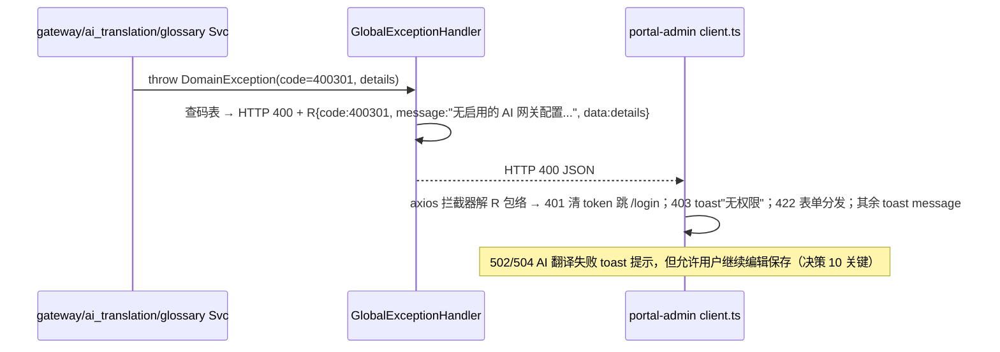

# 错误处理策略 - i18n-complete-with-ai-assist（增量）

本文档定义 i18n 变更新增的三个域（gateway / ai_translation / glossary）的分层错误处理、6 位错误码号段体系、外部 AI 网关降级与前端呈现约定。与 baseline 七域 error-strategy.md 并列（baseline 已有 catalog/trading/marketing/review/shipping/showroom/analytics 七域错误码，本变更新增三域）。

## 错误响应格式（与 baseline 一致）

**契约层**（三份 openapi 的 ErrorResponse）：
```json
{ "code": 502301, "message": "AI 网关调用失败", "details": { "gateway_error": "Rate limit exceeded (429)", "gateway_name": "OpenRouter 主网关" } }
```

**线上传输层**（huihao R 包络）：
```json
{ "code": 502301, "message": "...", "data": { "gateway_error": "...", "gateway_name": "..." } }
```

- 成功：`{ code: 0, message: "ok", data: <payload> }`；失败：`code` 为业务错误码，**details 内容装入 R 的 data 字段**。
- `message`：admin 端固定中文（i18n 变更仅后台管理，决策 8 后台不翻译）。
- 数字码为契约稳定锚点，文案变更不影响前端 code 映射。

## 错误码号段总表（i18n 变更新增三域）

| 体系 | 格式 | 号段 | 归属 |
|------|------|------|------|
| identity 既有 | 5 位：HTTP(3)+序号(2) | 40000~50401 | baseline（不改动） |
| 新七域（portal-api-integration） | 6 位：HTTP(3)+域段(1)+序号(2) | catalog=5/trading=6/marketing=7/review=8/shipping=9/analytics=0/showroom=1 | baseline（不改动） |
| **i18n 新增三域** | **6 位：HTTP(3)+域段(1)+序号(2)** | **gateway=2、ai_translation=3、glossary=4** | **本 change** |

高 3 位恒对应 HTTP 状态；同域同 HTTP 状态下序递增。集中码表按域维护在三份 openapi info 码表，本表为权威汇总。

## 错误分类与三域码表汇总

> message_zh 为 admin 端文案（决策 8 后台保持中文）。仅后台触达的码（admin-only），不出三语。

### gateway（域段 2）

| code | 标识 | HTTP | message_zh | 触发 | EDGE 场景 |
|------|------|------|-----------|------|-----------|
| 400201 | NON_AI_GATEWAY_NO_SYNC | 400 | 仅 AI 网关支持模型同步 | POST `/sync-models` 时 gateway_type != AI | — |
| 404201 | GATEWAY_CONFIG_NOT_FOUND | 404 | 网关配置不存在 | GET/PUT/DELETE `/configs/{id}` 不存在 | — |
| 409201 | GATEWAY_NAME_EXISTS | 409 | 配置名称已存在 | 同 gateway_type 下 name 冲突 | EDGE-012（并发保护在乐观锁层） |
| 409202 | GATEWAY_IN_USE | 409 | 网关配置已被翻译日志引用，不可删除 | DELETE 时 ai_translation_log 引用计数 > 0 | — |
| 422201 | FIELD_VALIDATION_FAILED | 422 | 字段校验失败 | details 字段级（URL 协议非法/名称为空等） | EDGE-006/007 |
| 422202 | API_KEY_DECRYPTION_FAILED | 422 | API Key 解密失败 | api_key_encrypted 密文损坏（极罕见，告警） | — |
| 502201 | GATEWAY_UNAVAILABLE | 502 | 网关不可达 | 测试连接时 DNS 解析失败/连接拒绝 | EDGE-023（测试连接失败反馈） |
| 502202 | GATEWAY_AUTH_FAILED | 502 | API Key 鉴权失败 | 测试连接时 401 Unauthorized | EDGE-023 |
| 504201 | GATEWAY_TIMEOUT | 504 | 连接超时 | 测试连接超时 10s | EDGE-023 |

### ai_translation（域段 3）

| code | 标识 | HTTP | message_zh | 触发 | EDGE 场景 |
|------|------|------|-----------|------|-----------|
| 400301 | NO_ENABLED_GATEWAY | 400 | 无启用的 AI 网关配置，请先在系统管理中配置网关 | `/translate` 时无 enabled=true 的 gateway_type=AI 配置 | EDGE-001 |
| 400302 | INVALID_MODEL | 400 | 请求的模型不在可用列表中 | `/translate` 时 request.model 不在 gateway.model_list 中 | EDGE-004（超长文本截断在前端，此为模型非法） |
| 422301 | FIELD_VALIDATION_FAILED | 422 | 字段校验失败 | source_text 为空/超长/target_lang 非法等 | EDGE-002/005 |
| 502301 | GATEWAY_CALL_FAILED | 502 | AI 网关调用失败 | Gateway 返回 4xx/5xx/429 | EDGE-003（空译文）/015（超时按 504）/016（5xx）/017（429） |
| 504301 | GATEWAY_TIMEOUT | 504 | AI 翻译请求超时，请稍后重试 | Gateway 调用超时 30s | EDGE-015 |

### glossary（域段 4）

| code | 标识 | HTTP | message_zh | 触发 | EDGE 场景 |
|------|------|------|-----------|------|-----------|
| 404401 | TERM_NOT_FOUND | 404 | 术语不存在 | GET/PUT/DELETE `/terms/{id}` 不存在 | — |
| 409401 | TERM_EN_EXISTS | 409 | 术语已存在 | 英文术语重复（不区分大小写） | — |
| 422401 | FIELD_VALIDATION_FAILED | 422 | 字段校验失败 | details 字段级（term_en 为空/超长等） | — |

**复用 identity 既有码**：401 未认证 → `40100`（AdminJwtFilter）；RBAC 无权限 → `40300`（EDGE-008/022 权限校验）；通用 404 → `40400`；500 内部错误 → `50000`；DB 异常 → `50001`。

**完整性核对**：三域共 18 个新码（gateway 9 / ai_translation 5 / glossary 3 / 复用 identity 5 码），无重复；高 3 位与 HTTP 状态一致；号段无交叉；与 L1.2 三份 openapi info 码表逐一一致。

## 分层错误处理（增量）

| 层级 | 职责 | 错误类型 | 处理方式 |
|------|------|----------|----------|
| **表示层（AdminGatewayController / AdminAiController / AdminGlossaryController + GlobalExceptionHandler）** | 捕获一切异常 → R.fail(code, message, data=details)；admin 中文；公开路径白名单放行匿名 | MethodArgumentNotValidException→422x01、DomainException、AccessDenied | 映射 HTTP + 6 位码；脱敏访问日志（API Key 掩码） |
| **应用层（gateway / ai_translation / glossary Svc）** | 业务规则与外部集成校验（网关可用性/模型有效性/术语唯一性） | NoEnabledGateway, InvalidModel, TermEnExists, GatewayNameExists, GatewayInUse | 抛领域异常，表示层映射 |
| **领域层（ExternalGatewayConfig / AiTranslationLog / AiTranslationGlossary 实体）** | 不变量与状态约束 | ApiKeyDecryptionFailed（密文损坏极罕见） | 抛领域异常向上传播 |
| **基础设施层（GatewayClient 集成端口）** | 外部 AI 网关调用错误 | GatewayCallFailed（4xx/5xx/429）、GatewayTimeoutGatewayAuthFailed | 转基础设施异常；按降级矩阵处理（记录 ai_translation_log status=failed，返回 502/504，允许用户继续保存） |

## 24 个 EDGE 场景的错误处理矩阵

| EDGE 场景 | 异常类型 | 传播路径（哪层抛/哪层捕获） | HTTP 状态码 | 错误码 | 用户提示 | 是否降级/重试/可继续 |
|-----------|---------|---------------------------|------------|--------|---------|---------------------|
| **空值与缺失** |
| EDGE-001 AI 网关未配置 | NoEnabledGateway | ai_translation Svc 抛 → GEH 捕获 | 400 | 400301 | "尚未配置 AI 网关，请前往系统管理 > 外部网关配置" | 弹窗提示，不发起请求 |
| EDGE-002 EN 主字段为空 | MethodArgumentNotValidException | Controller @Valid → GEH 捕获 | 422 | 422301 | "请先填写 EN 主字段内容" | 前端校验拦截，不发起后端请求 |
| EDGE-003 AI 返回空译文 | GatewayCallFailed | GatewayClient 抛 → ai_translation Svc 捕获，记 log status=empty_result | 502 | 502301 | "翻译结果为空，请重试或手动填写" | **允许继续保存**（决策 10） |
| EDGE-020 designerNote 缺失 | 不抛错 | catalog Svc 内 pick() 回退逻辑，回退 EN 主表值 | — | — | 正常显示 EN 回退值 | 数据层回退，无降级 |
| EDGE-021 邮件模板语言缺失 | 不抛错 | MailConsumer 回退使用 EN 模板，记 WARN 日志 | — | — | 用户收到 EN 邮件 | 回退 EN，邮件正常发送 |
| **边界值** |
| EDGE-004 超长文本翻译 | 不抛错 | 前端 maxlength 限制；后端按 max_tokens 配置截断发送 | — | — | 正常返回，log 记 input_length | 截断处理，不报错 |
| EDGE-005 自定义要求超长 | MethodArgumentNotValidException | Controller @Valid（maxLength=500） → GEH 捕获 | 422 | 422301 | 前端 maxlength 限制 500 | 前端防御，后端兜底 |
| EDGE-024 术语表过多 prompt 截断 | 不抛错 | ai_translation Svc 仅注入命中术语上限 50 条，超出按 category 优先级截断，记日志 | — | — | 正常翻译 | 智能截断，不报错 |
| **类型与格式** |
| EDGE-006 API Key 格式非法 | MethodArgumentNotValidException | Controller @Valid（trim 后非空） → GEH 捕获 | 422 | 422201 | "API Key 格式不正确" | 前端校验，后端兜底 |
| EDGE-007 网关 URL 协议非法 | MethodArgumentNotValidException | Controller @Valid（URL format） → GEH 捕获 | 422 | 422201 | "网关地址格式不正确" | 保存前校验 |
| EDGE-018 无效 locale 前缀 | 不抛错 | Next.js Middleware 检测非 en/es/fr → 302 重定向到无前缀 EN 路径 | 302 | — | 静默重定向 | 自动纠正，不报错 |
| EDGE-019 旧链接兼容 | 不抛错 | Middleware 按 cookie/Accept-Language → 301 永久重定向 | 301 | — | 静默重定向（SEO 友好） | 向后兼容，不报错 |
| **权限与认证** |
| EDGE-008 无系统管理权限 | AccessDenied | AdminJwtFilter RBAC(/system/gateways) → 路由守卫拦截 | 403 | 40300 | 跳转 /403 或 toast"无权限" | — |
| EDGE-009 翻译接口未登录 | Unauthorized | AdminJwtFilter 无有效 JWT → GEH 捕获 | 401 | 40100 | 跳转 /login | — |
| EDGE-010 API Key 不回传 | 不抛错 | gateway Svc 响应时掩码（取前缀+后4位，中间 ****） | — | — | 前端显示 sk-****1234 | 敏感信息保护 |
| EDGE-022 术语表权限 | AccessDenied | AdminJwtFilter RBAC(/system/glossary) → 路由守卫拦截 | 403 | 40300 | 跳转 /403 | — |
| **并发** |
| EDGE-011 同字段连点翻译 | 不抛错 | 前端按钮 loading 期间禁用，防止重复提交 | — | — | 按钮置灰 | 前端防御 |
| EDGE-012 网关配置编辑冲突 | OptimisticLockException | gateway Svc updated_at 乐观锁校验 → GEH 捕获 | 409 | 409201 | "配置已被他人修改，请刷新重试" | 提示刷新 |
| **状态流转** |
| EDGE-013 网关禁用后调用 | NoEnabledGateway | ai_translation Svc 读取 enabled=true 配置，空 → 抛异常 | 400 | 400301 | "AI 网关已禁用" | 等同未配置 |
| EDGE-014 模型刷新失败 | GatewayCallFailed | GatewayClient → gateway Svc 捕获，连续失败 ≥3 次降级 manual + 禁用 + 告警 | — | — | 配置页提示"模型列表获取失败，可手动刷新"；连续失败告警通知 | **降级策略**（决策 5） |
| **外部依赖** |
| EDGE-015 AI 网关超时 | GatewayTimeout | GatewayClient 30s 超时 → ai_translation Svc 捕获，记 log status=timeout | 504 | 504301 | "翻译超时，请重试" | **允许继续保存** |
| EDGE-016 AI 网关 5xx | GatewayCallFailed | GatewayClient → ai_translation Svc 捕获，记 log status=gateway_error + http_code | 502 | 502301 | "AI 网关调用失败" + 具体错误 | **允许继续保存** |
| EDGE-017 AI 网关限流 429 | GatewayCallFailed | GatewayClient → ai_translation Svc 捕获，记 log status=rate_limited | 502 | 502301 | "请求过于频繁，请稍后重试" | **允许继续保存** |
| EDGE-023 测试连接失败 | GatewayUnavailable / GatewayAuthFailed / GatewayTimeout | GatewayClient → gateway Svc 捕获 → 返回 GatewayTestResult{reachable:false, error_code, error_message} | 200（测试结果） | 502201/502202/504201（在 result 内） | 弹窗显示具体失败原因（DNS/鉴权/超时） | 测试不落库不影响配置 |

**关键设计原则（决策 10）**：AI 翻译失败（EDGE-003/015/016/017）一律记录 ai_translation_log status=failed，返回 502/504 错误码，前端 toast 提示但 **允许用户继续编辑保存**（不阻塞运营工作流，翻译失败可手动补填）。

---

## R 包络错误传播路径（后端 → portal-admin 前端）



前端不解析 message 文案做逻辑分支，**一律按 code 分支**；未知 code 兜底 `50000` 通用提示。

---

## 外部依赖失败降级矩阵（AI 网关 OpenAI-compatible 协议）

| 依赖 | 失败形态 | 降级行为 | 对用户影响 |
|------|---------|---------|-----------|
| **AI Gateway /v1/chat/completions** | 调用失败（4xx/5xx/429）、超时 30s、返回空译文 | ai_translation Svc 记录 ai_translation_log(status=failed/timeout/empty_result, error_message, latency_ms)，返回 502301/504301；前端 toast 提示 + **允许继续保存** | 翻译失败不阻塞工作流，运营可手动补填译文或稍后重试 |
| **AI Gateway /v1/models** | 保存配置时拉取失败 | 不阻断配置保存，model_list 保持空，models_synced_at 为 NULL，记录 WARN 日志；前端提示"模型列表获取失败，可手动刷新" | 配置可正常保存，运营后续手动刷新模型列表 |
| **AI Gateway /v1/models** | 定时刷新连续失败 ≥3 次（EDGE-014） | gateway Svc 自动降级：model_refresh_strategy → manual、enabled → false、consecutive_failures 记录；发告警通知（邮件/钉钉） | 网关自动禁用，运营收到告警后检查配置，手动刷新成功可恢复 |
| **AI Gateway /v1/models** | 测试连接失败（EDGE-023） | 返回 GatewayTestResult{reachable:false, error_code:502201/502202/504201, error_message, latency_ms}；测试不落库不影响已保存配置 | 弹窗显示具体失败原因（DNS 解析失败/401 鉴权失败/超时 10s），运营根据反馈调整配置 |
| **MySQL** | 访问失败 | 50001 DATABASE_ERROR（不暴露 SQL） | 写失败明确报错 |

**关键特性**：
1. **无阻塞原则**：AI 翻译失败不阻塞保存（决策 10），配置保存不因模型拉取失败而失败。
2. **自动降级**：定时刷新连续失败 3 次自动降级为手动刷新并禁用，防止持续打外部网关（决策 5）。
3. **详细反馈**：测试连接失败明确区分 DNS/鉴权/超时（EDGE-023），便于运营快速定位问题。

---

## 前端错误呈现约定（portal-admin，中文）

| 状态/码 | 呈现 |
|---------|------|
| 422 字段级 | 表单字段 inline（el 风格沿用现有组件）；其余 toast |
| 400301 无启用网关 | 弹窗提示"尚未配置 AI 网关，请前往系统管理 > 外部网关配置"，附带快捷跳转按钮 |
| 400302 模型无效 | toast"请求的模型不在可用列表中" + details.available_models 列表 |
| 502301/504301 AI 翻译失败 | toast 具体错误（超时/网关错误/限流）+ **允许继续编辑保存**（决策 10，不置灰保存按钮） |
| 409201 网关名称冲突 | toast"配置名称已存在" |
| 409202 网关被引用不可删除 | toast"网关配置已被翻译日志引用（{log_count} 条），不可删除" |
| 409401 术语已存在 | toast"术语已存在" + details.existing_id |
| 测试连接结果（GatewayTestResult） | 弹窗：成功 → 绿色 ✓ "连接成功 \| 可用模型 {count} 个 \| 耗时 {ms}ms"；失败 → 红色 ✗ "DNS 解析失败/API Key 鉴权失败/连接超时" + error_message |
| 401 | 清 token → 跳 `/login`（admin JWT 8h 无 refresh，沿用 identity 约定） |
| 403 `40300` | toast"无权限"；菜单/路由由 permissions 预隐藏（RBAC 守卫），错误码为兜底 |
| 5xx | toast"操作失败" + 保留表单现场 |

**AI 翻译弹窗特殊处理**：502/504 错误时弹窗不关闭，显示红色错误提示框（含错误消息），用户可：1) 点击「重试」再次调用；2) 点击「取消」关闭弹窗，表单字段保持 EN 原文，继续编辑其他字段并保存。

---

## 敏感信息脱敏（扩展 baseline 规则）

| 类别 | 规则 |
|------|------|
| API Key 明文 | 完全不落日志；响应时掩码（前缀+****+后4位，如 sk-****1234）；前端显示掩码，编辑时判定：明文→重新加密存储；掩码→保持原密文 |
| api_key_encrypted 密文 | 可落库；日志/响应均不出现，仅解密时内存中短暂存在 |
| AI Gateway 响应（source_text/translated_text） | ai_translation_log 全文落库（业务追溯必要）；admin 调用日志列表页截断展示前 100 字符，详情页完整显示 |
| custom_requirement | 落 ai_translation_log，运营自主追加的翻译要求，不脱敏 |
| 错误 message | 不回显外部网关的敏感错误细节（如 API Key invalid 具体值），统一为"鉴权失败（401）" |

---

## L2 设计要求

L2 Error Designer 须在详设中：
1. 定义 GlobalExceptionHandler 异常类型→三域码表的完整映射表（含 MethodArgumentNotValidException → 422201/422301/422401 的 details 字段级结构）。
2. 给出 ExternalGatewayConfig 实体的 consecutive_failures 字段（INT DEFAULT 0）与定时任务降级逻辑的状态机定义。
3. 给出 ai_translation_log.status 枚举映射（success=1 / failed=2 / timeout=3 / empty_result=4 / rate_limited=5）。
4. 给出 GatewayClient（RestTemplate/WebClient）的超时配置（翻译 30s / 模型拉取 10s / 测试连接 10s）与重试策略（翻译/测试不重试；模型拉取失败由定时任务兜底，单次不重试）。
5. 明确 API Key AES-256-GCM 加密的密钥管理方案（存环境变量 `GATEWAY_ENCRYPTION_KEY` / Spring Cloud Config / Vault，密钥轮转策略）。

---

## 检查清单

- [x] 错误码体系完整（覆盖 400/401/403/404/409/422/502/504 全部场景，三域 18 码 + identity 复用 5 码）
- [x] 错误码无重复、号段无交叉（6 位 HTTP+域段+序号，gateway=2/ai_translation=3/glossary=4）
- [x] 每个错误码有 message_zh 与触发说明；admin 端中文（决策 8）
- [x] 24 个 EDGE 场景的错误处理矩阵完整（异常类型/传播路径/HTTP 状态码/错误码/用户提示/降级策略）
- [x] R 包络错误传播路径明确（GlobalExceptionHandler → portal-admin client.ts 处理约定）
- [x] 外部依赖降级矩阵完整（AI Gateway 超时/5xx/429/模型刷新连续失败降级/测试连接失败反馈）
- [x] 前端错误呈现约定明确（422 字段级 / 502/504 AI 翻译失败允许继续 / 测试连接结果弹窗）
- [x] 敏感信息脱敏规则覆盖（API Key 掩码 / 密文不出响应 / 翻译日志落库与展示截断）
- [x] 与 L1.2 三份 openapi 码表、data-flow.md 流程编号交叉引用一致
- [x] 逐条响应 boundary-scenarios.yml 24 个 EDGE 场景（见错误处理矩阵）
- [x] 决策 10（失败允许继续）贯穿全文：502/504 AI 翻译失败不阻塞保存，前端不置灰保存按钮


